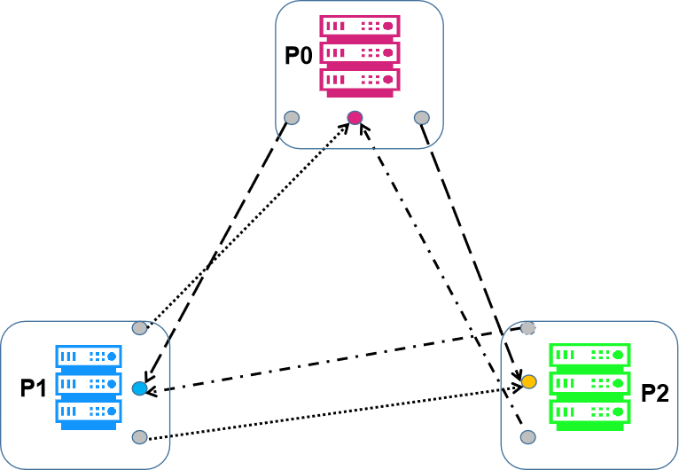
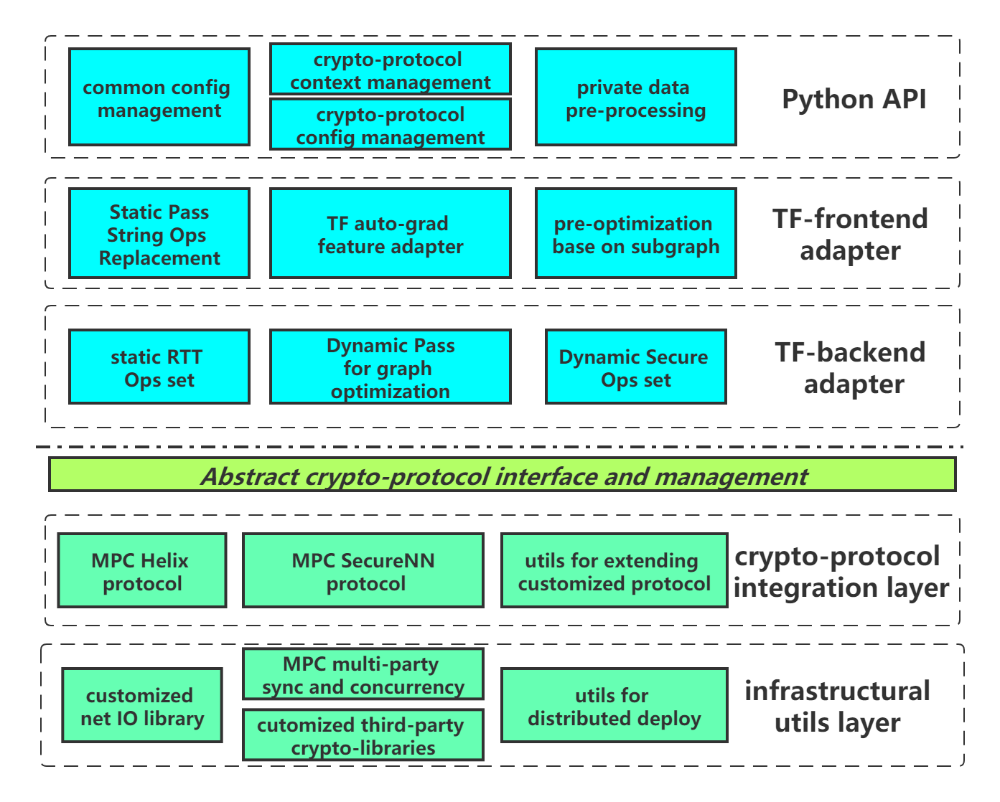
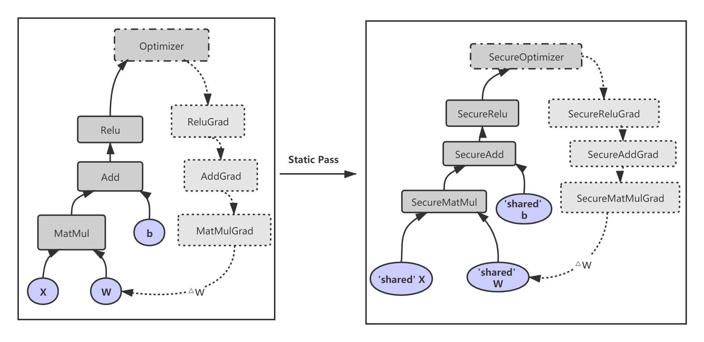
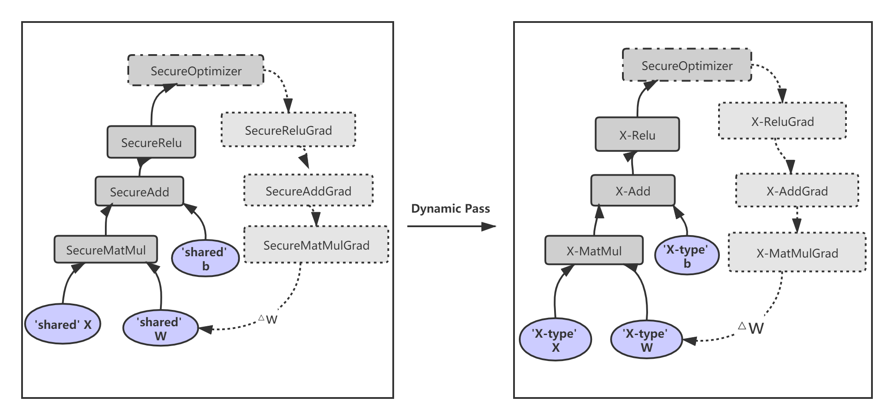

[](https://www.gnu.org/licenses/lgpl-3.0.en.html)

[](https://github.com/LatticeX-Foundation/Rosetta/actions/workflows/build-and-test.yml) [](https://github.com/LatticeX-Foundation/Rosetta/actions/workflows/performance-test.yml)

------

[中文版](./README_CN.md)


## Overview

Rosetta is a privacy-preserving framework based on [TensorFlow](https://www.tensorflow.org). It integrates with mainstream privacy-preserving computation technologies, including cryptography, federated learning and trusted execution environment. Rosetta aims to provide privacy-preserving solutions for artificial intelligence without requiring expertise in cryptography, federated learning and trusted execution environment. Rosetta reuses the APIs of TensorFlow and allows to transfer traditional TensorFlow codes into a privacy-preserving manner with minimal changes. E.g., just add the following line.

```python
import latticex.rosetta
```

The current version integrates the secure multi-party computation protocols for 3 parties. The underlying protocols are [SecureNN](https://eprint.iacr.org/2018/442.pdf) and Helix. They are secure in the semi-honest model with honest majority.

Rosetta has also integrated an efficient zero-knowledge proof protocol, [Mystique](https://eprint.iacr.org/2021/730), for secure inference tasks of sophisticated AI models, such as ResNet. Please refer to [example](example/zkp_resnet/README.md) for its usage.


## Installation

For now, Rosetta runs on Ubuntu 18.04, and is based on TensorFlow 1.14 with CPUs (Windows OS is not currently supported yet). You can install Rosetta as follows.

First, please check that your local system meets our [base environment requirement](doc/DEPLOYMENT.md#rosetta-deployment-guide).

Then install the native TensorFlow with the following codes. Note that you could also install it from source code, check [here](doc/TENSORFLOW_INSTALL.md) for details.

```bash
# install tensorflow
pip3 install tensorflow==1.14.0
```

And then build and install Rosetta with our all-in-one script as follows.

```bash
# clone rosetta git repository
git clone --recurse https://github.com/LatticeX-Foundation/Rosetta.git

or (Note: due to recent github change of personal token, SSH is still working, please refer to github for latest updates)
git clone git@github.com:LatticeX-Foundation/Rosetta.git
git submodule update --init --recursive
cd Rosetta
# compile, install. You may check more compilation options by checking `rosetta.sh --help`
./rosetta.sh compile --enable-protocol-mpc-securenn; ./rosetta.sh install
```

Before running your program, you should configure with your network topology so that a distributed network can be established for parties to communicate with each other.



You could use an example to check everything runs OK. Please refer to [Deployment Guide](doc/DEPLOYMENT.md) for the detailed steps of installation, configuration and deployment of Rosetta.

## Usage

The following is a toy [example](example/tutorials/code/rosetta_demo.py) for matrix multiplication using Rosetta.

In this example, we assume that three guys want to get the product of their private matrix, while do not want others to know what they hold. For brevity, we call them P0, P1 and P2.

With Rosetta, each of them can run the following script, from which you can see that only a small amount of codes are needed besides the native TensorFlow lines.

```python
#!/usr/bin/env python3

# Import rosetta package
import latticex.rosetta as rtt
import tensorflow as tf

# You can activate a backend protocol, here we use SecureNN
rtt.activate("SecureNN")

# Get private data from every party
matrix_a = tf.Variable(rtt.private_console_input(0, shape=(3, 2)))
matrix_b = tf.Variable(rtt.private_console_input(1, shape=(2, 1)))
matrix_c = tf.Variable(rtt.private_console_input(2, shape=(1, 4)))

# Just use the native tf.matmul operation.
cipher_result = tf.matmul(tf.matmul(matrix_a, matrix_b), matrix_c)

# Start execution
with tf.Session() as sess:
    sess.run(tf.global_variables_initializer())
    # Take a glance at the ciphertext
    cipher_result = sess.run(cipher_result)
    print('local ciphertext result:', cipher_result)
    # Set only party a and c can get plain result
    a_and_c_can_get_plain = 0b101 
    # Get the result of Rosetta matmul
    print('plaintext matmul result:', sess.run(rtt.SecureReveal(cipher_result, a_and_c_can_get_plain)))
```

To run this jointly, after configuring networks, the three guys can run the following command-line respectively:

```bash
python rosetta_demo.py --party_id=0
```

,

```bash
python rosetta_demo.py --party_id=1
```

and

```bash
python rosetta_demo.py --party_id=2
```

Then each party will be prompted to input his private matrix, for example P0 may have:

> 2021-10-22 09:46:08.571|info|Rosetta: Protocol [SecureNN] backend initialization succeeded! task: , node id: P0
> 
> please input the private data (float or integer, 6 items, separated by space): 2 3 1 7 6 2

while P1 has:

> 2021-10-22 09:46:08.571|info|Rosetta: Protocol [SecureNN] backend initialization succeeded! task: , node id: P1
>
> please input the private data (float or integer, 2 items, separated by space): 1 2

while P2 has:

> 2021-10-22 09:46:08.571|info|Rosetta: Protocol [SecureNN] backend initialization succeeded! task: , node id: P2
>
> please input the private data (float or integer, 4 items, separated by space): 2 1 4 3

Note that input from console like this is purely for pedagogical purpose in this toy example. See our [Doc](doc/API_DOC.md) for production-ready data APIs.

At the end, P0 and P2 will get the plaintext output while P1 dose not, just as required. Specifically, P0 and P2 may have:

> plaintext matmul result: [[b'16.000000' b'8.000000' b'32.000000' b'24.000000']
>
>  [b'30.000000' b'15.000000' b'60.000000' b'45.000000']
>
>  [b'20.000000' b'10.000000' b'40.000000' b'30.000000']]
>
> 2021-10-22 09:49:58.888|info|Rosetta: Protocol [SecureNN] backend has been released.

while P1 has:

> plaintext matmul result: [[b'0.000000' b'0.000000' b'0.000000' b'0.000000']
>
>  [b'0.000000' b'0.000000' b'0.000000' b'0.000000']
>
>  [b'0.000000' b'0.000000' b'0.000000' b'0.000000']]
>
> 2021-10-22 09:49:58.887|info|Rosetta: Protocol [SecureNN] backend has been released.

That's all, you can see Rosetta is so easy to use.


<br/>

So, how to use ZKP in Rosetta quickly? Similar to MPC above, here is a simple [example](example/tutorials/code/rosetta_demo_zkp.py).


```python
#!/usr/bin/env python3

# Import rosetta package
import latticex.rosetta as rtt
import tensorflow as tf

# You can activate a backend protocol, here we use Mystique
rtt.activate("Mystique")

# P0 is the Prover, providing all the witnesses(private), and
# P1 is the Verifier
matrix_a = tf.Variable(rtt.private_console_input(0, shape=(3, 2)))
matrix_b = tf.Variable(rtt.private_console_input(0, shape=(2, 3)))

# Just use the native tf.matmul operation.
cipher_result = tf.matmul(matrix_a, matrix_b)

# Start execution
with tf.Session() as sess:
    sess.run(tf.global_variables_initializer())
    # Take a glance at the ciphertext
    cipher_result_v = sess.run(cipher_result)
    print('local ciphertext result:', cipher_result_v)
    # Get the result of Rosetta matmul
    print('plaintext result:', sess.run(rtt.SecureReveal(cipher_result)))

rtt.deactivate()
```

Here P0 is the Prover, providing all the witnesses(private), and the input is as follows:


> 2021-10-22 18:12:46.629|info|Rosetta: Protocol [Mystique] backend initialization succeeded! task: , node id: P0
> 
> 2021-10-22 18:12:46.629|info|create and activate ok. task:  for protocol: Mystique
> 
> please input the private data (float or integer, 6 items, separated by space): 0 1 2 3 4 5
> 
> please input the private data (float or integer, 6 items, separated by space): 5 4 3 2 1 0


Here P1 is the Verifier, at the end, the verification is successful, and the plaintext result is output as follows:

> 2021-10-22 18:13:12.860|info|succeed in verifying zk!!
> 
> plaintext result: [[b'2.000000' b'1.000000' b'0.000000']
> 
>  [b'16.000000' b'11.000000' b'6.000000']
> 
>  [b'30.000000' b'21.000000' b'12.000000']]
> 
> 2021-10-22 18:13:13.009|info|Rosetta: Protocol [Mystique] backend has been released.

<br/>

For more details, please check [Tutorials](doc/TUTORIALS.md) and [Examples](./example).

> Note: Currently Rosetta already supports 128-bit integer data type, which can be enabled by configuring the environment variable `export ROSETTA_MPC_128=ON` and adding option `--enable-128bit` when compiling.

## Getting Started

To help you start with your first workable program with Rosetta easily, our [Tutorials](doc/TUTORIALS.md) will lead you to this fantastic world. In this detailed tutorials, we will assist you learn the basic concepts about Rosetta, then show you how to use the interfaces that we provide by easy-to-understand examples, and finally help you build a workable privacy-preserving machine learning model on real-world datasets.

Hopefully, this tutorial, and more other examples in [Examples](./example), will whet your appetite to dive in knowing more about this privacy-preserving framework.

## How Rosetta Works

Rosetta works by extending and hacking both Python frontend and the Operation Kernels in backend of TensorFlow. It decouples the development of TensorFlow-related components and privacy technology so that both developers from AI and cryptography can focus on what they are interested.



When running your Rosetta program, firstly the native TensorFlow data flow graph will be converted, and during this process the native Operations within the graph will be replaced with SecureOps.



And at the second stage, the backend kernels of operations, implemented with specific cryptographic protocol, will be called to carry out underlying secure computation.



## Contributing to Rosetta

Rosetta is an open source project developed under the LPGLv3 license and maintained by [LatticeX Foundation](https://latticex.foundation/). Contributions from individuals and organizations are all welcome. Before beginning, please take a look at our [contributing guidelines](CONTRIBUTING.md). Our project adheres to [code of conduct](CODE_OF_CONDUCT.md). By participating in our community, you are expected to uphold this code. You could also open an issue by clicking [here](https://github.com/LatticeX-Foundation/Rosetta/issues/new).

## Documents List

* [Rosetta Tutorials](doc/TUTORIALS.md)

* [Rosetta Deployment Guide](doc/DEPLOYMENT.md)

* [Rosetta User API](doc/API_DOC.md)

* [Rosetta WhitePaper](doc/Rosetta_whitepaper.pdf)

* [Rosetta Glossary](doc/GLOSSARY.md)

* [Rosetta Release Notes](RELEASE.md)
  
* [FAQ](https://github.com/LatticeX-Foundation/Rosetta/wiki/FAQ)


## Citation

You can cite our work as folllows:
```latex 
    @misc{Rosetta,
      author = {Yuanfeng Chen and Gaofeng Huang and Junjie Shi and Xiang Xie and Yilin Yan},
      title = {{Rosetta: A Privacy-Preserving Framework Based on TensorFlow}},
      howpublished = {\url{https://github.com/LatticeX-Foundation/Rosetta}},
      year={2020}
    }
```

## Reference

Check this [wiki page](https://github.com/LatticeX-Foundation/Rosetta/wiki/Reference) for the reference.

## Contact

You could reach us by [email](mailto:rosetta@latticex.foundation). **And you are welcome to join Rosetta community on [Slack](https://join.slack.com/t/latticexrosetta/shared_invite/zt-dum6j65d-MTxp~Bxq5OwouJW8zUKB1Q) to ask any questions and discuss on any interesting topics with other developers**.

## License

The Rosetta library is licensed under the [GNU Lesser General Public License v3.0](COPYING.LESSER).
