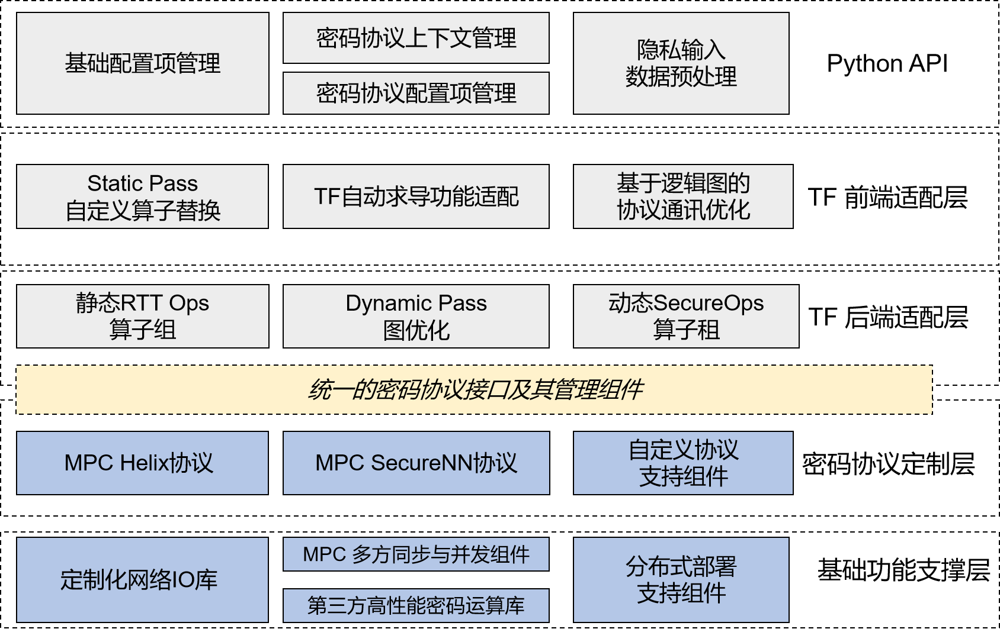

[](https://www.gnu.org/licenses/lgpl-3.0.en.html)

[](https://github.com/LatticeX-Foundation/Rosetta/actions/workflows/build-and-test.yml) [](https://github.com/LatticeX-Foundation/Rosetta/actions/workflows/performance-test.yml)

------


## 概述

Rosetta 是基于[TensorFlow](https://www.tensorflow.org)开发的一个隐私计算框架，旨在为人工智能(AI)提供快速、安全、可以保护隐私的技术解决方案，而不需要用户（AI开发者）掌握任何密码学（cryptography）、联邦学习（FL）和硬件安全执行环境（TEE）领域的专业知识。Rosetta 在用户接口层复用了 TensorFlow 的对外 API，从而使得用户可以以最低的改造成本将隐私保护功能集成到现有的 TensorFlow 程序中。比如在简单场景下，通过`import`即可完成这样的转换：

```python3
import latticex.rosetta
```


## Rosetta 整体架构

Rosetta 是通过深度扩展、改造 TensorFlow 的前后端各个组件，并融合底层密码学协议来实现的。通过划分不同的层次和模块，实现 TensorFlow 相关的 AI 框架相关部分和隐私保护技术相关部分的解耦，从而便于来自 AI 领域和来自隐私计算技术领域的专家开发者可以专注于各自擅长和感兴趣的部分，快速的进一步扩展 Rosetta。



在运行 Rosetta 程序时，在数据流图的构建阶段，原生的 TensorFlow 数据流图中的算子（无论是前向子图还是后向梯度子图中的算子）会被自动的替换为 Rosetta 中对应的具有隐私保护功能的 SecureOp 算子。


然后在实际开始执行各个算子时，SecureOp 算子中会进一步的根据用户所配置的后端协议调用具体协议中的基础运算算子来实现多方协同的隐私计算。


Rosetta 当前版本集成了3方交互（3-server model）的安全多方计算（MPC）协议。当前使用的默认底层协议是 [SecureNN](https://eprint.iacr.org/2018/442.pdf)。这一协议可以在诚实者占多数的半诚实安全模型假设下保障数据安全。我们将陆续集成更多密码学、联邦学习和可行执行环境（TEE）等主流的隐私计算技术和更多高效的安全协议进来，同时，也欢迎开发者参照[协议集成示例](https://github.com/LatticeX-Foundation/Rosetta/pull/38)自行集成协议。


## 文档列表

* [Rosetta 术语表](doc/GLOSSARY_CN.md)

* [Rosetta 白皮书](doc/Rosetta_whitepaper_cn.pdf)

* [Rosetta 教程](doc/TUTORIALS_CN.md)

* [Rosetta 部署手册](doc/DEPLOYMENT_CN.md)

* [Rosetta 接口文档](doc/API_DOC_CN.md)

* [Rosetta 版本说明](RELEASE.md)
  
* [FAQ](https://github.com/LatticeX-Foundation/Rosetta/wiki/FAQ)


## Rosetta安装

目前，Rosetta 可以运行在 Ubuntu 18.04 操作系统下，并基于 TensorFlow 1.14 CPU 版本开发。后续还将开放更稳定、更多元化的版本。

安装Rosetta前，请确保安装环境符合[系统要求](doc/DEPLOYMENT_CN.md#系统要求)。

当前仅支持源码方式安装Rosetta，二进制方式即将推出。请用如下命令一键安装脚本来编译与安装 Rosetta 包：

```bash
# clone rosetta git repository
git clone --recurse https://github.com/LatticeX-Foundation/Rosetta.git
cd Rosetta && source rtt_completion
# compile, install. You may check more compilation options by checking `./rosetta.sh --help`
./rosetta.sh compile --enable-protocol-mpc-securenn; ./rosetta.sh install
```

安装完成后，检测安装是否成功也不再是难题。在任何你需要使用Rosetta的地方（`Python` 脚本文件中），导入Rosetta包即可：

```python3
import latticex.rosetta as rtt
```

如果没有报错，恭喜你，Rosetta已安装成功！下面我们来看看应用示例吧。


 > ***在生产环境中，数据是分布式存储的，所以在运行之前还需进行多方之间网络拓扑关系等信息的配置，以使得分布式执行时多方之间可以正常的通讯。***
 > 
 > ***实际运用场景的安装、配置和部署的步骤请参考[部署指南](doc/DEPLOYMENT_CN.md#部署)。***


## 使用示例

这里我们用多方执行矩阵乘法的例子来演示Rosetta的基本用法。此处默认不同用户/机构间已配置好网络拓扑等信息。

矩阵乘法是AI中常见的操作。基于Rosetta，我们可以实现：在每方机构持有各自私有数据，且不想泄露自己明文数据的前提下，进行联合计算并让有限方得到矩阵乘积的可能性。

这里我们用三个bash来模拟独立的三方，P0、P1和P2。可以是本地的三个bash（本机模拟三方）也可以是三个不同的机构/节点（实际应用场景）。每方需按照同一套执行方案来计算，且需要三方共同启动执行来完成。


示例执行方案详见：[demo 示例](example/tutorials/code/rosetta_demo.py)，路径：`example/tutorials/code/`，执行命令如下：

第一个bash模拟P0方，即party_id=0：

```1：bash
python3 rosetta_demo.py --party_id=0
```

第二个bash模拟P1方，即party_id=1：

```2：bash
python3 rosetta_demo.py --party_id=1
```

第三个bash模拟P2方，即party_id=2：

```3：bash
python3 rosetta_demo.py --party_id=2
```

当三方均准备就绪后，每方可以privately输入己方数据，如下P0方的输入为`2 3 1 7 6 2`：

> [2020-07-29 20:10:49.070] [info] Rosetta: Protocol [SecureNN] backend initialization succeeded!
>
> please input the private data (float or integer, 6 items, separated by space): 2 3 1 7 6 2

如我们在程序中指定的那样，

```python3
# Set only party a and c can get plain result
a_and_c_can_get_plain = 0b101
```

只有 P0 和 P2 可以得到最终的明文结果，而P1不会拿到任何有意义的结果。当然，也可以只让一方知道结果，或者所有方均得到明文结果。

想看输出结果？自己跑跑看吧！相信你一定能行！:)

如此，还想了解更多？去看看[示例目录](./example)吧。

> 提示: 当前 Rosetta 版本已经可以支持128-bit的大整数数据类型，这意味着底层的密码协议可以有更高的精度选择空间，你可以通过在环境变量中设置`export ROSETTA_MPC_128=ON`来开启这一服务。

## 快速上手

为了进一步帮助你快速的上手 Rosetta，实现自己的程序。我们在[教程文档](doc/TUTORIALS_CN.md)中进一步介绍了 Rosetta 的使用。在这个教程中，我们会首先介绍关于 Rosetta 的一些基本概念，然后通过一系列简单易懂的例子协助你在真实数据集上构建一个完整可运行的实际隐私保护的机器学习模型。

> **为了帮助大家进一步了解 Rosetta 的整体设计和工程化实践，我们会持续发表一系列的深度技术文章，比如在[InfoQ上的专栏介绍](https://www.infoq.cn/profile/931348F344CDE1/publish/article)，欢迎大家持续关注。**

## 参与Rosetta建设

Rosetta 是一个由[Lattice基金会]((https://latticex.foundation/))维护的、基于 LPGLv3 许可证的开源项目。

**我们欢迎来自个人和组织的各种贡献，包括代码开发、文档撰写、合作交流等各个方面，也欢迎 star、推广我们的 Github 项目**。具体内容请参考[社区参与指南](CONTRIBUTING.md)、[社区行为规范](CODE_OF_CONDUCT.md)。如果在使用或开发中有任何的问题，你也可以直接的在 [这里](https://github.com/LatticeX-Foundation/Rosetta/issues/new)给我们提 issues。

## 文档列表

* [Rosetta 教程](doc/TUTORIALS_CN.md)

* [Rosetta 部署手册](doc/DEPLOYMENT_CN.md)

* [Rosetta 用户使用手册](doc/API_DOC_CN.md)

* [Rosetta 白皮书](doc/Rosetta_whitepaper_cn.pdf)

* [Rosetta 术语表](doc/GLOSSARY_CN.md)

* [Rosetta 版本说明](RELEASE.md)
  
* [FAQ](https://github.com/LatticeX-Foundation/Rosetta/wiki/FAQ)

## 引用方式

如果需要引用我们的项目，可以使用如下的格式:
```latex 
    @misc{Rosetta,
      author = {Yuanfeng Chen, Gaofeng Huang, Junjie Shi, Xiang Xie, and Yilin Yan},
      title = {{Rosetta: A Privacy-Preserving Framework Based on TensorFlow}},
      howpublished = {\url{https://github.com/LatticeX-Foundation/Rosetta}},
      year={2020}
    }
```

## 参考文献

可以查看 [wiki 页面](https://github.com/LatticeX-Foundation/Rosetta/wiki/Reference) 了解我们参考的学术论文和相关软件.

## 联系方式

你可以通过[邮箱](mailto:rosetta@latticex.foundation)联系我们。**也非常欢迎加入我们在 [Slack](https://join.slack.com/t/latticexrosetta/shared_invite/zt-dum6j65d-MTxp~Bxq5OwouJW8zUKB1Q)上的 Rosetta 社区以获取最新资讯、和其他开发者一起交流讨论。**

## 许可证

Rosetta 代码库基于 [GNU Lesser General Public License v3.0](COPYING.LESSER) 许可证开放使用。
