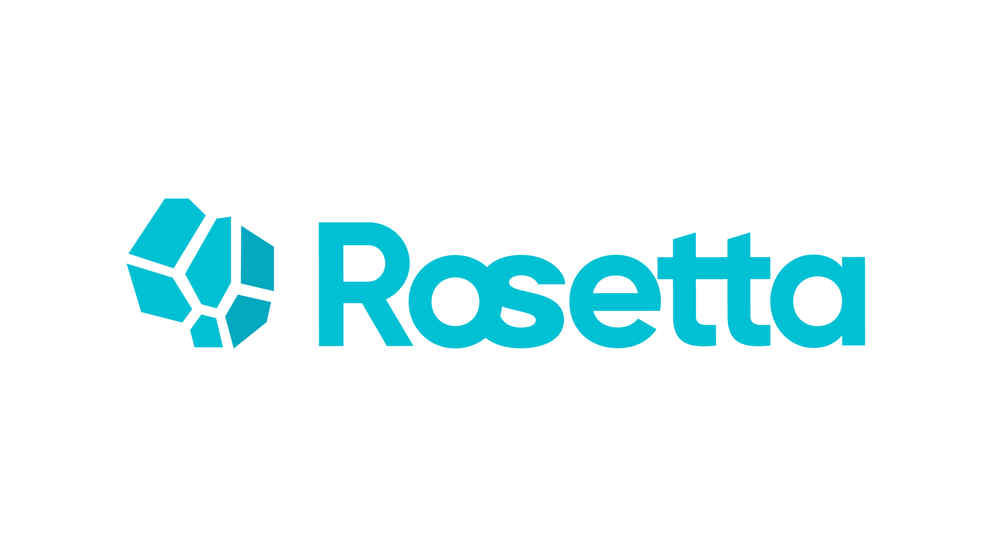

[](https://www.gnu.org/licenses/lgpl-3.0.en.html)

--------------------------------------------------------------------------------

## 概述

Rosetta 是基于[TensorFlow](https://www.tensorflow.org)开发的一个隐私计算框架。它将陆续集成密码学、联邦学习和可行执行环境（TEE）等主流的隐私计算技术。Rosetta 旨在为人工智能快速提供隐私保护技术解决方案，而不需要用户掌握任何密码学、联邦学习和TEE领域的专门知识。Rosetta 在用户接口层复用了 TensorFlow 的对外 API 从而使得用户可以以最低的改造成本将隐私保护功能集成到现有的 TensorFlow 程序中。比如在简单场景下，你可能只需要添加如下一行代码就可以完成这样的转换：

```python
import latticex.rosetta
```

当前版本集成了3方参与的安全多方计算（MPC）协议。当前使用的默认底层协议是 [SecureNN](https://eprint.iacr.org/2018/442.pdf)。这一协议可以在诚实者占多数的半诚实安全模型假设下保障数据安全。

## 安装

目前，Rosetta 可以运行在 Ubuntu 18.04 操作系统下（其他环境有待测试验证），并且基于 TensorFlow 1.14 CPU 版本开发。你可以按如下方式完成安装。

首先，请确认您本地系统的基础环境已经符合[要求](doc/DEPLOYMENT_CN.md#rosetta-deployment-guide)。

然后使用如下命令行安装原生 TensorFlow 库。你也可以通过编译 TensorFlow 源码加以安装，具体方法请参考[这里](doc/TENSORFLOW_INSTALL_CN.md).

```bash
# install tensorflow
pip3 install tensorflow==1.14.0
```

接下来就是使用我们提供的一键安装脚本来编译与安装 Rosetta 包了,命令如下：

```bash
# clone rosetta git repository
git clone https://github.com/LatticeX-Foundation/Rosetta.git
cd Rosetta
# compile, install and run test cases
bash compile_and_test_all.sh
```

安装完成后，你可以基于下面我们会介绍的一些例子去验证下是否安装成功。在实际的使用中，在运行之前还需要进行多方之间网络拓扑关系等信息的配置，以使得分布式执行时多方之间可以正常的通讯。


更多完整具体的安装、配置和部署的步骤请参考[部署指南](doc/DEPLOYMENT_CN.md)。

## 使用示例

这里我们用一个简单的多方联合执行 AI 中常见的矩阵乘法操作的 [demo 示例](example/tutorials/code/rosetta_demo.py) 来演示下 Rosetta 的基本用法。

在这个例子中，我们假设三个个体各自持有一个私有的矩阵数据，他们想在不泄露自己数据明文的前提下共同的计算出这三个矩阵的乘积。为了简便，我们称这三方分别为 P0，P1 和 P2。

基于 Rosetta，每一方可以直接运行下面的代码即可完成这个任务。如果你熟悉 TensorFlow 的话，你可以看出只需要改动简单的几行代码就可以完全的复用 TensorFlow 中的 API 接口了。

```python
#!/usr/bin/env python3

# Import rosetta package
import latticex.rosetta as rtt
import tensorflow as tf

# You can activate a backend protocol, here we use SecureNN
rtt.activate("SecureNN")

# Get private data from every party
matrix_a = tf.Variable(rtt.private_console_input(0, shape=(3, 2)))
matrix_b = tf.Variable(rtt.private_console_input(1, shape=(2, 1)))
matrix_c = tf.Variable(rtt.private_console_input(2, shape=(1, 4)))

# Just use the native tf.matmul operation.
cipher_result = tf.matmul(tf.matmul(matrix_a, matrix_b), matrix_c)

# Start execution
with tf.Session() as sess:
    sess.run(tf.global_variables_initializer())
    # Take a glance at the ciphertext
    cipher_result = sess.run(cipher_result)
    print('local ciphertext result:', cipher_result)
    # Set only party a and c can get plain result
    a_and_c_can_get_plain = 0b101 
    # Get the result of Rosetta matmul
    print('plaintext matmul result:', sess.run(rtt.SecureReveal(cipher_result, a_and_c_can_get_plain)))
```

运行这个隐私计算程序需要三方的协同，在配置好网络拓扑等信息后，三方可以各自执行下面的命令行即可启动执行:

```bash
python rosetta_demo.py --party_id=0
```

,

```bash
python rosetta_demo.py --party_id=1
```

以及

```bash
python rosetta_demo.py --party_id=2
```

运行时各方会被提示输入自己的隐私数据（注意，这里是为了便于演示采用了这种输入方式，在实际中请采用 Rosetta 中的数据预处理接口），比如 P0 可以在提示下如下输入自己的私有数据：

> [2020-07-29 20:10:49.070] [info] Rosetta: Protocol [SecureNN] backend initialization succeeded!
>
> please input the private data (float or integer, 6 items, separated by space): 2 3 1 7 6 2

在程序的最后，如我们在程序中特意指定的那样，只有 P0 和 P2 可以得到最后的明文结果：

> plaintext matmul result: [[b'8.000000' b'14.000000' b'18.000000' b'4.000000']
> [b'4.000000' b'7.000000' b'9.000000' b'2.000000']
> [b'24.000000' b'42.000000' b'54.000000' b'12.000000']]
>
> [2020-07-29 20:11:06.452] [info] Rosetta: Protocol [SecureNN] backend has been released.

而 P1 方则不会拿到有意义的明文结果:
> plaintext matmul result: [[b'0.000000' b'0.000000' b'0.000000' b'0.000000']
> [b'0.000000' b'0.000000' b'0.000000' b'0.000000']
> [b'0.000000' b'0.000000' b'0.000000' b'0.000000']]
>
> [2020-07-29 20:11:06.452] [info] Rosetta: Protocol [SecureNN] backend has been released.

就是这样，你可以看出 Rosetta 是很方便易用的。

想要体验更多的例子，可以参考[示例目录](./example).

> 提示: 当前 Rosetta 版本已经可以支持128-bit的大整数数据类型，这意味着底层的密码协议可以有更高的精度选择空间，你可以通过在环境变量中设置`export ROSETTA_MPC_128=ON`来开启这一服务。

## 快速上手

为了进一步帮助你快速的上手 Rosetta，实际的实现自己的程序。我们在[教程文档](doc/TUTORIALS_CN.md)中一步步的介绍了 Rosetta 使用的基本内容。在这个教程中，我们会首先介绍关于 Rosetta 的一些基本概念，然后通过一系列简单易懂的例子协助您在真实数据集上构建一个完整可运行的实际隐私保护的机器学习模型。

## Rosetta 整体架构

Rosetta 是通过深度扩展、改造 TensorFlow 的前后端各个组件，并融合底层密码学协议来实现的。通过划分不同的层次和模块，实现 TensorFlow 相关的 AI 框架相关部分和隐私保护技术相关部分的解耦，从而便于来自 AI 领域和来自隐私计算技术领域的专家开发者可以专注于各自擅长和感兴趣的部分，快速的进一步扩展 Rosetta。


在运行 Rosetta 程序时，在数据流图的构建阶段，原生的 TensorFlow 数据流图中的算子（无论是前向子图还是后向梯度子图中的算子）会被自动的替换为 Rosetta 中对应的具有隐私保护功能的 SecureOp 算子。


然后在实际开始执行各个算子时，SecureOp 算子中会进一步的根据用户所配置的后端协议调用具体协议中的基础运算算子来实现多方协同的隐私计算。


> **为了帮助大家进一步了解 Rosetta 的整体设计和工程化实践，我们会持续发表一系列的深度技术文章，比如在[InfoQ上的专栏介绍](https://www.infoq.cn/profile/931348F344CDE1/publish/article)，欢迎大家持续关注。**

## 参与Rosetta建设

Rosetta 是一个由[Lattice基金会]((https://latticex.foundation/))维护的、基于 LPGLv3 许可证的开源项目。

**我们欢迎来自个人和组织的各种贡献，包括代码开发、文档撰写、合作交流等各个方面，也欢迎 star、推广我们的 Github 项目**。具体内容请参考[社区参与指南](CONTRIBUTING.md)、[社区行为规范](CODE_OF_CONDUCT.md)。如果在使用或开发中有任何的问题，你也可以直接的在 [这里](https://github.com/LatticeX-Foundation/Rosetta/issues/new)给我们提 issues。

## 文档列表

* [Rosetta 教程](doc/TUTORIALS_CN.md)

* [Rosetta 部署手册](doc/DEPLOYMENT_CN.md)

* [Rosetta 用户使用手册](doc/API_DOC_CN.md)

* [Rosetta 白皮书](doc/Rosetta_whitepaper_cn.pdf)

* [Rosetta 术语表](doc/GLOSSARY_CN.md)

* [Rosetta 版本说明](RELEASE.md)

## 联系方式

你可以通过[邮箱](mailto:rosetta@latticex.foundation)联系我们。**也非常欢迎加入我们在 [Slack](https://join.slack.com/t/latticexrosetta/shared_invite/zt-dum6j65d-MTxp~Bxq5OwouJW8zUKB1Q)上的 Rosetta 社区以获取最新资讯、和其他开发者一起交流讨论。**

## 许可证

Rosetta 代码库基于 [GNU Lesser General Public License v3.0](COPYING.LESSER) 许可证开放使用。
