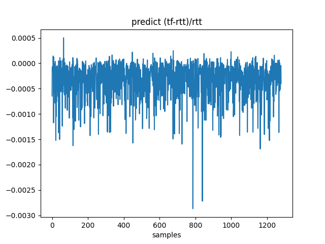
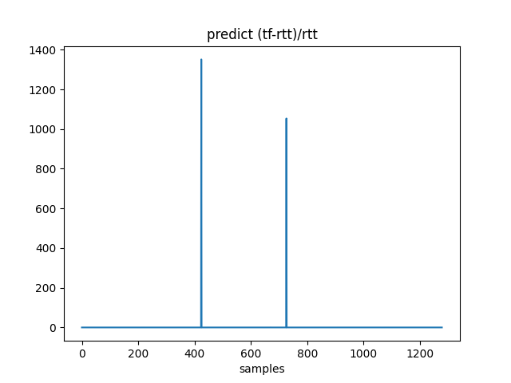

- [Overview](#overview)
- [Installation and Deployment](#installation-and-deployment)
- [Quick Start](#quick-start)
- [Secure Multi-Party Computation](#secure-multi-party-computation)
  - [Millionaires' Problem](#millionaires-problem)
    - [TensorFlow Version](#tensorflow-version)
    - [Rosetta Version](#rosetta-version)
- [Privacy-Preserving Machine Learning](#privacy-preserving-machine-learning)
  - [Linear Regression](#linear-regression)
    - [TensorFlow Version](#tensorflow-version-1)
    - [Rosetta Basic Version](#rosetta-basic-version)
    - [Rosetta Version-with Reveal](#rosetta-version-with-reveal)
    - [Comparison and Evaluation 1](#comparison-and-evaluation-1)
    - [Comparison and Evaluation 2](#comparison-and-evaluation-2)
    - [Model Saving](#model-saving)
    - [Model Loading and Prediction](#model-loading-and-prediction)
  - [Logistic Regression](#logistic-regression)
  - [Support big data sets](#support-big-data-sets)
- [Conclusion](#conclusion)
- [Additional Notes](#additional-notes)
  - [Dataset Description](#dataset-description)


## Overview


## Installation and Deployment

If you have not set up a `rosetta` environment yet, please refer to [Deployment Document](./DEPLOYMENT.md).

In order to simplify the description of this tutorial, the examples below are based on `single machine with multiple nodes` mode, please refer to `Deployment Documentation` for deployment in this way.

## Quick Start

All of the following content is based on the previous installation and deployment you have completed. For saving time, please make sure that your environment is already `OK`.

Unless otherwise noted, all commands are run in the path of `example/tutorials/code/`.

<br/>

Now, let us enter this exciting moment together: how to use `rosetta` in the easiest way?

The steps are very simple. Whenever you want to use `rosetta` (` Python` script file), just import our `rosetta` package, as follows:

```python
import latticex.rosetta as rtt
```

<font style = "color: green"> Note: </font> 

`rtt` is short for `rosetta`, just like `tf` for `tensorflow`, `np` for `numpy`, `pd` for `pandas` . Let's just view this as a convention.

<br/>

You can run directly in the same terminal, as follows:

```sh
./tutorials.sh rtt quickstart
```

Or, you can run the following program on three different terminals (just to simulate the scenario that three different parties are running on their own private data on their own machine):

```sh
# node 0
python3 quickstart.py --party_id=0
```

```sh
# node 1
python3 quickstart.py --party_id=1
```

```sh
# node 2
python3 quickstart.py --party_id=2
```

If you see `DONE!` in the output, you have accomplished the first goal.

> `--party_id` This is a command line option that specifies which role the current running script is playing.

>  In the following, in order to describe examples concisely, we will just directly uses `./tutorials.sh` to show that we are running the three steps above. 

<br/>

The following tutorial is just as easy as this `Quick Start`. Let's continue.


## Secure Multi-Party Computation

Let's assume that there are `two` `honest` rich millionaires who are discussing on `who has more wealth`, while neither of them wants to tell the other one the specific number on their bank account. What can I do? I can't help it, but `Rosetta` can help you. Now, let's try to solve this problem.

### Millionaires' Problem

The problem we have just proposed is a famous example in MPC, called [Yao's Millionaires' Problem](https://en.wikipedia.org/wiki/Yao%27s_Millionaires%27_Problem). 

Let‘s be a little more specific. In the following example, we will introduce two millionaires, one called `Alice` and the other called `Bob`, have `$2000001` and `$2000000` respectively. You see, the difference between the two people's wealth is just `one` dollars.

#### TensorFlow Version

For comparison，Let's just solve this problem without taking their privacy into consideration at first. 

This is trivial, every child can do this in less than one second. But in order to compare with `rosetta`, here we write a toy program in `tensorflow` style:

The first step is to import the package:

```py
import tensorflow as tf
```

The second step is to set how much wealth each has:

```py
Alice = tf.Variable(2000001)
Bob = tf.Variable(2000000)
```

The third step is to call `session.run` and check the results:

```py
res = tf.greater(Alice, Bob)
init = tf.global_variables_initializer()
with tf.Session() as sess:
    sess.run(init)
    ret = sess.run(res)
    print("ret:", ret)  # ret: True
```

Refer to [tf-millionaire.py](../example/tutorials/code/tf-millionaire.py) for the full version.

And now, we run this program as follows:

```sh
./tutorials.sh tf millionaire
```

The output will show:

```log
ret: True
```

The result shows that `Alice` has more wealth than `Bob`.


It's intuitive, I won't go into details.

#### Rosetta Version

The above is a artificial one. Now let's see how to use `rosetta` to solve the original problem of millionaires without leaking their privacy. Let's begin, and you will see it is very simple!

The first step is to import the `rosetta` package.

```py
import latticex.rosetta as rtt
import tensorflow as tf
```


The second step is activate protocol.

```py
rtt.rtt.activate("SecureNN")
```

The third step is to set how much wealth each has privately.

We use the built-in `rtt.private_console_input` to get the private data entered by the user in the terminal.

```py
Alice = tf.Variable(rtt.private_console_input(0))
Bob = tf.Variable(rtt.private_console_input(1))
```

The forth step is exactly the same as `tensorflow`.

```py
res = tf.greater(Alice, Bob)
init = tf.global_variables_initializer()
with tf.Session() as sess:
    sess.run(init)
    res = sess.run(res)
    print('res:', res)  # res: 722739251331272.4
```

The above output of `res` is a `sharing` value in [Secret-Sharing scheme](GLOSSARY.md).


> The `sharing` value is a random number essentially. an original true value x, is randomly split into two 64-bit values ​​x0, x1 (with x = x0 + x1), which are held by P0 and P1, respectively.


How do we know the plaintext value? We provide a `reveal` interface to get the plain text value for convenience in debugging and testing. Just add it after the forth step:

```py
with tf.Session() as sess:
    # ...
    ret = rtt.SecureReveal(res)
    print('ret:', sess.run(ret))  # ret: 1.0
```

For the complete program of console version, refer to [rtt-millionaire-console.py](../example/tutorials/code/rtt-millionaire-console.py).

For the complete program of script version, refer to  [rtt-millionaire.py](../example/tutorials/code/rtt-millionaire.py).

Run this program as follows:

```sh
./tutorials.sh rtt millionaire
```

The output is as follows:

```log
ret: 1.0
```

The result indicates that `Alice` has more wealth than `Bob`.

<br/>

> For a description of all operators supported by `rosetta` including `SecureReveal`, please refer to our [API Document](./API_DOC.md).

<br/>

Of course, `Rosetta` can not only be used to solve simple problems  like `Millionaire's Problem`. Next, let’s see how we can tackle real problems in `Machine Learning` with the help of `Rosetta` framework.

## Privacy-Preserving Machine Learning

We will talk about the combination of `Privacy-Preserving` and` Machine Learning (ML)` in this part. Let's start with the simplest machine learning model: `Linear Regression`.

### Linear Regression

This section introduces how to use `rosetta` to perform a complete `Linear Regression` task, including `data processing`, `training and model saving`, `model loading and prediction` and `evaluation`.

Before using `rosetta` for machine learning, in order to compare with `rosetta`-backed MPC version, let's see how we do the same task in native `tensorflow` style without the concern of data privacy.

#### TensorFlow Version

Here is a simple `Linear Regression` with `tensorflow`.

- Import necessary packages, set training parameters, etc.

```py
import math
import os
import csv
import tensorflow as tf
import numpy as np
import pandas as pd
from util import read_dataset

np.set_printoptions(suppress=True)

os.environ['TF_CPP_MIN_LOG_LEVEL'] = '3'

np.random.seed(0)

EPOCHES = 100
BATCH_SIZE = 16
learning_rate = 0.0002
```

- Load dataset

Please refer to the appendix at the end of this tutorial.

We highlight codes that are different from `rosetta`, and we will focus more on them later.

```py
# real data
# ######################################## difference from rosettta
file_x = '../dsets/ALL/reg_train_x.csv'
file_y = '../dsets/ALL/reg_train_y.csv'
real_X, real_Y = pd.read_csv(file_x).to_numpy(), pd.read_csv(file_y).to_numpy()
# ######################################## difference from rosettta
DIM_NUM = real_X.shape[1]
```

- Write a Linear Regression model.

We will not go into details here, and only present the code below. For details, please refer to `TensorFlow™` official website about writing machine learning models.

```py
X = tf.placeholder(tf.float32, [None, DIM_NUM])
Y = tf.placeholder(tf.float32, [None, 1])

# initialize W & b
W = tf.Variable(tf.zeros([DIM_NUM, 1]))
b = tf.Variable(tf.zeros([1]))

# predict
pred_Y = tf.matmul(X, W) + b

# loss
loss = tf.square(Y - pred_Y)
loss = tf.reduce_mean(loss)

# optimizer
train = tf.train.GradientDescentOptimizer(learning_rate).minimize(loss)

init = tf.global_variables_initializer()
```


- Model training.

```py
with tf.Session() as sess:
    sess.run(init)
    xW, xb = sess.run([W, b])
    print("init weight:{} \nbias:{}".format(xW, xb))

    # train
    BATCHES = math.ceil(len(real_X) / BATCH_SIZE)
    for e in range(EPOCHES):
        for i in range(BATCHES):
            bX = real_X[(i * BATCH_SIZE): (i + 1) * BATCH_SIZE]
            bY = real_Y[(i * BATCH_SIZE): (i + 1) * BATCH_SIZE]
            sess.run(train, feed_dict={X: bX, Y: bY})

            j = e * BATCHES + i
            if j % 50 == 0 or (j == EPOCHES * BATCHES - 1 and j % 50 != 0):
                xW, xb = sess.run([W, b])
                print("I,E,B:{:0>4d},{:0>4d},{:0>4d} weight:{} \nbias:{}".format(
                    j, e, i, xW, xb))

    # predict
    Y_pred = sess.run(pred_Y, feed_dict={X: real_X, Y: real_Y})
    print("Y_pred:", Y_pred)
```

For complete code reference Please refer to [tf-linear_regression.py](../example/tutorials/code/tf-linear_regression.py) for the complete source code.


And then, we run this program as follows:

```sh
./tutorials.sh tf linear_regression
```

The output is as follows:

```log
Y_pred: [[5.409453 ]
 [5.803287 ]
 [5.9634194]
 ...
 [4.978249 ]
 [5.9761114]
 [5.9929996]]
```


#### Rosetta Basic Version


As mentioned above, if you have an existing model training script (`.py`) written with `tensorflow`, then all you need to do is import the following packages on the first line of this script file:

```python
import latticex.rosetta as rtt
```

**Yes, it's that simple!** You don't need to modify any already written code. Even if you don’t have any knowledge of cryptography, you can use it easily. The only difference is about the how to set your private data.

- Activate protocol

```py
rtt.rtt.activate("SecureNN")
```

> Note: The protocol must be activated before any `MPC` related `API` can be used.


- Load dataset

Please refers to the appendix at the end of this article for the dataset description. 


We have highlighted the spots that are different from `tensorflow`. In contrast to the native `tensorflow` version without data privacy. Except for the importing of the `rosetta` package, only these several lines are different.

`rosetta` provides a class, `PrivateDataset`, specifically for handling private data sets. Check the relevant source code for details.

```py
# real data
# ######################################## difference from tensorflow
file_x = '../dsets/P' + str(rtt.mpc_player.id) + "/reg_train_x.csv"
file_y = '../dsets/P' + str(rtt.mpc_player.id) + "/reg_train_y.csv"
real_X, real_Y = rtt.PrivateDataset(data_owner=(
    0, 1), label_owner=1).load_data(file_x, file_y, header=None)
# ######################################## difference from tensorflow
DIM_NUM = real_X.shape[1]
```

Please refer to [rtt-linear_regression.py](../example/tutorials/code/rtt-linear_regression.py) for the complete source code.

<br/>

OK. Now let's briefly summarize the difference from the `tensorflow` version:

- Importing `rosetta` package.
- Activate protocol.
- Loading data sets.

<br/>

Now, we have written the complete code, then how do we run it?

Do you still remember the above `Millionaires' Problem` example that you have learned? There is no difference in running them.

Just run it as follows:

```sh
./tutorials.sh rtt linear_regression
```

The output is as follows:

```log
Y_pred: [[1.22580022e+14]
 [1.22481157e+14]
 [1.22514398e+14]
 ...
 [1.22532401e+14]
 [1.22508954e+14]
 [1.22495981e+14]]
```

Don't be panic, what you're seeing are `random` values in [`Secret sharing` scheme](GLOSSARY.md), rather than plaintext values, because Rosetta is protecting the privacy of your own data right now.

#### Rosetta Version-with Reveal

The `sharing value` output in the previous section is not human-readable. For testing, debugging, comparison with plain text ans so on, we provide a `reveal` interface to get the plain text value.

<font style = "color: red"> Reminder:please be cautious when using this reveal interface in a production environment. </font>

Let's modify the previous (basic version) program with addition of `reveal`, and see what effect it has. The new program is as follows:

```py
# ########### for test, reveal
reveal_W = rtt.SecureReveal(W)
reveal_b = rtt.SecureReveal(b)
reveal_Y = rtt.SecureReveal(pred_Y)
# ########### for test, reveal

with tf.Session() as sess:
    sess.run(init)
    rW, rb = sess.run([reveal_W, reveal_b])
    print("init weight:{} \nbias:{}".format(rW, rb))

    # train
    BATCHES = math.ceil(len(real_X) / BATCH_SIZE)
    for e in range(EPOCHES):
        for i in range(BATCHES):
            bX = real_X[(i * BATCH_SIZE): (i + 1) * BATCH_SIZE]
            bY = real_Y[(i * BATCH_SIZE): (i + 1) * BATCH_SIZE]
            sess.run(train, feed_dict={X: bX, Y: bY})

            j = e * BATCHES + i
            if j % 50 == 0 or (j == EPOCHES * BATCHES - 1 and j % 50 != 0):
                rW, rb = sess.run([reveal_W, reveal_b])
                print("I,E,B:{:0>4d},{:0>4d},{:0>4d} weight:{} \nbias:{}".format(
                    j, e, i, rW, rb))

    # predict
    Y_pred = sess.run(reveal_Y, feed_dict={X: real_X, Y: real_Y})
    print("Y_pred:", Y_pred)
```

Please refer to [rtt-linear_regression_reveal.py](../example/tutorials/code/rtt-linear_regression_reveal.py) for the complete source code.


Then, we run it as follows:

```sh
./tutorials.sh rtt linear_regression_reveal
```

And, the output will be as follows:

```log
Y_pred: [[5.40625 ]
 [5.828125]
 [5.953125]
 ...
 [5.      ]
 [5.984375]
 [5.984375]]
```


Try to compare this output with the output of the `tensorflow` version to see how much the error is.


#### Comparison and Evaluation 1

Here is the tutorial, you can get both the predicted value and weight value of `tensorflow` version and `rosetta` version.

For models with few parameters, (the error in the previous section) can be barely recognized at the first sight, but if there are many parameters and the dataset is very large, then auxiliary tools are needed.

We only list the final comparison results here. For details, refer to `Comparison and Evaluation 2`.

Below is a comparison of the evaluation result of `tensorflow` and `rosetta`.

TensorFlow:

```json
{
  "tag": "tensorflow",
  "mse": 0.5182142087177698,
  "rmse": 0.7198709667140145,
  "mae": 0.4328875541499997,
  "evs": 0.22396289848005935,
  "r2": 0.19491626081852909
}
```

Rosetta:

```json
{
  "tag": "rosetta",
  "mse": 0.5210866435592723,
  "rmse": 0.7218633136261132,
  "mae": 0.421875,
  "evs": 0.2204962547250663,
  "r2": 0.19045372284900097
}
```

We can see that the evaluation scores (with little loss on precision) are almost the same.


> R^2 is lower because this dataset is a Logistic Regression model, not a Linear Regression model

> Here we only need to care about the error between the two versions (it is very small)


The following figure is about the error comparison between the predicted values ​​of `tensorflow` and `rosetta`.




#### Comparison and Evaluation 2

We only show the final result in `Comparison and Evaluation 1` section. Here we dive a little deeper with the inner process. You can skip this section if not interested.


> In this section, Linear Regression is evaluated using R^2, and Logistic Regression is evaluated using AUC/ACC/F1 Evaluation.

<br/>

Next, let’s modify the last part of the program and add the statistical functionality (this modification is the same for the `tesnorflow` version and the `rosetta` version)

```py
# #############################################################
# save to csv for comparing, for debug
scriptname = os.path.basename(sys.argv[0]).split(".")[0]
csvprefix = "./log/" + scriptname
os.makedirs(csvprefix, exist_ok=True)
csvprefix = csvprefix + "/tf"
# #############################################################

with tf.Session() as sess:
    sess.run(init)
    xW, xb = sess.run([W, b])
    print("init weight:{} \nbias:{}".format(xW, xb))

    # train
    BATCHES = math.ceil(len(real_X) / BATCH_SIZE)
    for e in range(EPOCHES):
        for i in range(BATCHES):
            bX = real_X[(i * BATCH_SIZE): (i + 1) * BATCH_SIZE]
            bY = real_Y[(i * BATCH_SIZE): (i + 1) * BATCH_SIZE]
            sess.run(train, feed_dict={X: bX, Y: bY})

            j = e * BATCHES + i
            if j % 50 == 0 or (j == EPOCHES * BATCHES - 1 and j % 50 != 0):
                xW, xb = sess.run([W, b])
                print("I,E,B:{:0>4d},{:0>4d},{:0>4d} weight:{} \nbias:{}".format(
                    j, e, i, xW, xb))
                savecsv("{}-{:0>4d}-{}.csv".format(csvprefix, j, "W"), xW)
                savecsv("{}-{:0>4d}-{}.csv".format(csvprefix, j, "b"), xb)

    # predict
    Y_pred = sess.run(pred_Y, feed_dict={X: real_X, Y: real_Y})
    print("Y_pred:", Y_pred)
    savecsv("{}-pred-{}.csv".format(csvprefix, "Y"), Y_pred)

    # save real y for evaluation
    savecsv("{}-real-{}.csv".format(csvprefix, "Y"), real_Y)
```

Please refer to [tf-linear_regression_stat.py](../example/tutorials/code/tf-linear_regression_stat.py) for the complete code.

Please refer to  [rtt-linear_regression_stat.py](../example/tutorials/code/rtt-linear_regression_stat.py) for the complete code.


Then, you will get the evaluation results after running it as follows:

```sh
./tutorials.sh tf linear_regression_stat
./tutorials.sh rtt linear_regression_stat
./tutorials.sh stat linear_regression_stat linear
```


#### Model Saving

So far, we just output the model parameters and predicted values ​​to the terminal. How can we save the trained model as we often do in machine learning?

You may wonder, since we are doing all these in a multi-party way, WHERE will the trained model (should) be saved after running with `rosetta`? And HOW to save it? Good question. Let’s talk about the model saving.


There are several conventions:

- If you want to use `rosetta` for prediction on shared private dataset, please save the model as `cipher text`.

- If you save the model as plain text, and want to use this model to make predictions on plaintext, please use `tensorflow` directly to make predictions.

Regarding the saving of the plaintext result, you can choose to save at node 0, node 1, node 2, or all three nodes. This setting is in the configuration file.

> You can try to modify the value of `SAVER_MODE` in the configuration file to see how it works.

`SAVER_MODE` is a flag of a bitmap combination, and its meaning is as follows

```
// 0: Save the cipher text. (And the number 1 ~ 7 below indicates which specific parties to  save the plain text files)
// 1: P0,
// 2: P1,
// 4: P2,
// 3: P0 and P1
// 5: P0 and P2
// 6: P1 and P2
// 7: P0, P1 and P2
```


<br/>

In this section, we will use `rosetta` to train the model, then save the model as `plaintext`, and then load this `plaintext model` into the `tensorflow` version for prediction. Finally we check the difference between using `tensorflow` on plaintext dataset without data privacy with this one.

<br/>

Based on the previous version of `rosetta`, we added some code related to `save`.

Before training starts:

```py
# save
saver = tf.train.Saver(var_list=None, max_to_keep=5, name='v2')
os.makedirs("./log/ckpt"+str(party_id), exist_ok=True)
```

After training:

```py
saver.save(sess, './log/ckpt'+str(party_id)+'/model')
```
Please refer to [rtt-linear_regression_saver.py](../example/tutorials/code/rtt-linear_regression_saver.py) for details.


And then run it as follows:

```sh
./tutorials.sh rtt linear_regression_saver
```

#### Model Loading and Prediction

The model has been saved to the corresponding node in the previous step (according to the configuration file). Now use `tensorflow` to load the plaintext model saved in the previous step and make predictions.


```py
# save
saver = tf.train.Saver(var_list=None, max_to_keep=5, name='v2')
os.makedirs("./log/ckpt0", exist_ok=True)

# restore mpc's model and predict
with tf.Session() as sess:
    sess.run(init)
    if os.path.exists("./log/ckpt0/checkpoint"):
        saver.restore(sess, './log/ckpt0/model')

    # predict
    Y_pred = sess.run(pred_Y)
    print("Y_pred:", Y_pred)
```


For the complete code, please refer to [tf-linear_regression_restore.py](../example/tutorials/code/tf-linear_regression_restore.py).

And then run it as follows:

```sh
./tutorials.sh tf linear_regression_restore
```

The output will be as follows:

```log
Y_pred: [[5.4112522 ]
 [5.80601873]
 [5.96399414]
 ...
 [4.97999231]
 [5.97734902]
 [5.98777173]]
```

<br/>

Summary:

Complete source code list reference

TensorFlow version

|                              |                                                                                              |
| ---------------------------- | -------------------------------------------------------------------------------------------- |
| Basics                       | [tf-linear_regression.py](../example/tutorials/code/tf-linear_regression.py)                 |
| Model Training and Saving    | [tf-linear_regression_saver.py](../example/tutorials/code/tf-linear_regression_saver.py)     |
| Model loading and prediction | [tf-linear_regression_restore.py](../example/tutorials/code/tf-linear_regression_restore.py) |
| Evaluation                   | [tf-linear_regression_stat.py](../example/tutorials/code/tf-linear_regression_stat.py)       |

Rosetta version

|                                       |                                                                                                |
| ------------------------------------- | ---------------------------------------------------------------------------------------------- |
| Basics                                | [rtt-linear_regression.py](../example/tutorials/code/rtt-linear_regression.py)                 |
| Basic (output plain text)             | [rtt-linear_regression_reveal.py](../example/tutorials/code/rtt-linear_regression_reveal.py)   |
| Model Training and Saving             | [rtt-linear_regression_saver.py](../example/tutorials/code/rtt-linear_regression_saver.py)     |
| Model (Cipher) loading and prediction | [rtt-linear_regression_restore.py](../example/tutorials/code/rtt-linear_regression_restore.py) |
| Evaluation                            | [rtt-linear_regression_stat.py](../example/tutorials/code/rtt-linear_regression_stat.py)       |

### Logistic Regression

With the foundation of `Linear Regression` above, then `Logistic Regression` is `very`, `very`, `very simple`.

Based on Linear Regression, we use `sigmoid` as a binary classifier and `cross entropy` as a loss function to build a Logistic Regression model.

Regardless of the `tensorflow` version or the` rosetta` version, the changes are the same. Compared with the `Linear Regression` version, only the model construction part needs to be changed, that is, only the following modification is needed:

- On the predicted value part, add `sigmoid` functionality

- On the loss function part, we replace them with cross entropy function

```py
# predict
pred_Y = tf.sigmoid(tf.matmul(X, W) + b)

# loss
logits = tf.matmul(X, W) + b
loss = tf.nn.sigmoid_cross_entropy_with_logits(labels=Y, logits=logits)
loss = tf.reduce_mean(loss)
```

Complete source code list reference:

TensorFlow version

|                              |                                                                                                  |
| ---------------------------- | ------------------------------------------------------------------------------------------------ |
| Basics                       | [tf-logistic_regression.py](../example/tutorials/code/tf-logistic_regression.py)                 |
| Model Training and Saving    | [tf-logistic_regression_saver.py](../example/tutorials/code/tf-logistic_regression_saver.py)     |
| Model loading and prediction | [tf-logistic_regression_restore.py](../example/tutorials/code/tf-logistic_regression_restore.py) |
| Evaluation                   | [tf-logistic_regression_stat.py](../example/tutorials/code/tf-logistic_regression_stat.py)       |

Rosetta version

|                                       |                                                                                                    |
| ------------------------------------- | -------------------------------------------------------------------------------------------------- |
| Basics                                | [rtt-logistic_regression.py](../example/tutorials/code/rtt-logistic_regression.py)                 |
| Basic (output plain text)             | [rtt-logistic_regression_reveal.py](../example/tutorials/code/rtt-logistic_regression_reveal.py)   |
| Model Training and Saving             | [rtt-logistic_regression_saver.py](../example/tutorials/code/rtt-logistic_regression_saver.py)     |
| Model (Cipher) loading and prediction | [rtt-logistic_regression_restore.py](../example/tutorials/code/rtt-logistic_regression_restore.py) |
| Evaluation                            | [rtt-logistic_regression_stat.py](../example/tutorials/code/rtt-logistic_regression_stat.py)       |


Just run these programs in the same as in `Linear Regression`.


<br/>

Here is the comparison of the two different versions of Logistic Regression model.


TensorFlow:

```json
{
  "tag": "tensorflow",
  "score_auc": 0.7346938775510203,
  "score_ks": 0.428171268507403,
  "threshold_opt": 0.6036468147999999,
  "score_accuracy": 0.71,
  "score_precision": 0.8666666666666667,
  "score_recall": 0.5098039215686274,
  "score_f1": 0.6419753086419753
}
```
Rosetta:

```json
{
  "tag": "rosetta",
  "score_auc": 0.7366946778711485,
  "score_ks": 0.42737094837935174,
  "threshold_opt": 0.6110839844,
  "score_accuracy": 0.71,
  "score_precision": 0.84375,
  "score_recall": 0.5294117647058824,
  "score_f1": 0.6506024096385543
}
```

> Here we only care about the error between the two versions (we can see that it is very small)

> Rosetta is even slightly better than TensorFlow


The following figure is about the error comparison between the predicted values ​​of `tensorflow` and `rosetta`.




### Support big data sets
The above linear regression and logistic regression models all load the entire dataset into memory and then take it out in batch order for training, and as the size of the dataset grows, it becomes impractical to load the dataset into memory at once.

Major plaintext AI frameworks such as TensorFlow are aware of and provide solutions, TensorFlow provides the relevant Dataset APIs to build low-memory consuming, complex, reusable data pipelines, since Rosetta uses Tensorflow as a backend, it can be reused with minor modifications.

We use logistic regression model as an example to illustrate how to train a model with large datasets.

For the TensorFlow version complete code, please refer to [tf-ds-lr.py](../example/tutorials/code/tf-ds-lr.py).

For the Rosetta version complete code, please refer to [rtt-ds-lr.py](../example/tutorials/code/rtt-ds-lr.py).

Analysis of the code in tf-ds-lr.py and rtt-ds-lr.py reveals two main differences.

1. Create a text line dataset, use TextLineDataset class in TensorFlow and use PrivateTextLineDataset class in Rosetta.
    The code used in TensorFlow is as following:
    ```py
    dataset_x = tf.data.TextLineDataset(file_x)
    ...
    ```
    The code used in Rosetta is as following:
    ```py
    dataset_x0 = rtt.PrivateTextLineDataset(
                    file_x, data_owner=0)  # P0 hold the file data
    ...
    ```

2. Decode functions are implemented differently. TensorFlow version of the decode function split rows to corresponding fields and then converts the fields to floating-point numbers, while the Rosetta version of the decode function also first split rows to corresponding fields and then calls `PrivateInput` function to share the data.
    The code used in TensorFlow is as following:
    ```py
    # dataset decode
    def decode_x(line):
        fields = tf.string_split([line], ',').values
        fields = tf.string_to_number(fields, tf.float64)
        return fields
    ```
    The code used in Rosetta is as following:
    ```py
    # dataset decode
    def decode_p0(line):
        fields = tf.string_split([line], ',').values
        fields = rtt.PrivateInput(fields, data_owner=0) # P0 hold the file data
        return fields
    ```

## Conclusion

That's all.

Now, you have fully mastered the usage of `Rosetta`, go to find a real problem to play with.

welcome!


## Additional Notes


### Dataset Description

The data set source reference [here](http://archive.ics.uci.edu/ml/datasets/Wine+Quality).

We have performed simple pre-process steps to get the results as follows, the path is in `dsets/`, and the directory structure is as follows:

```
dsets/
├── ALL
│   ├── cls_test_x.csv
│   ├── cls_test_y.csv
│   ├── cls_train_x.csv
│   ├── cls_train_y.csv
│   ├── reg_test_x.csv
│   ├── reg_test_y.csv
│   ├── reg_train_x.csv
│   └── reg_train_y.csv
├── P0
│   ├── cls_test_x.csv
│   ├── cls_test_y.csv
│   ├── cls_train_x.csv
│   ├── cls_train_y.csv
│   ├── reg_test_x.csv
│   └── reg_train_x.csv
├── P1
│   ├── cls_test_x.csv
│   ├── cls_train_x.csv
│   ├── reg_test_x.csv
│   ├── reg_test_y.csv
│   ├── reg_train_x.csv
│   └── reg_train_y.csv
└── P2
```

|        |                                                                     |
| ------ | ------------------------------------------------------------------- |
| ALL    | Raw data of the dataset                                             |
| P*     | Indicates the private data owned by each node                       |
| cls*   | Represents a binary classification data set for Logistic Regression |
| reg*   | Regression data set, used for Linear Regression                     |
| *train | Represents the data set used for training                           |
| *test  | Represents the data set used for prediction                         |
| *x     | Indicates sample                                                    |
| *y     | Means label                                                         |

Description:

For comparison with the plaintext (TensorFlow version), we divided the original data set into two parts in the vertical direction, one as private data of `P0` and the other as private data of` P1`.

1. The data under ALL is used for TensorFlow version.
2. The private data of each node of P0/P1 is stored on each node.
3. P2 has no data.
4. The label for Logistic Regression is owned by P0, and the label for Linear Regression is owned by P1.

