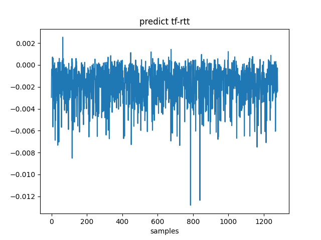
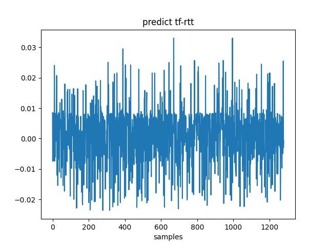

- [概述](#概述)
- [安装部署](#安装部署)
- [快速入门](#快速入门)
- [安全多方计算](#安全多方计算)
  - [百万富翁](#百万富翁)
    - [TensorFlow 版本](#tensorflow-版本)
    - [Rosetta 版本](#rosetta-版本)
- [隐私机器学习](#隐私机器学习)
  - [线性回归](#线性回归)
    - [TensorFlow 版本线性回归](#tensorflow-版本线性回归)
    - [Rosetta 基础版](#rosetta-基础版)
    - [Rosetta 版本-Reveal](#rosetta-版本-reveal)
    - [对比与评估 1](#对比与评估-1)
    - [对比与评估 2](#对比与评估-2)
    - [模型保存](#模型保存)
    - [模型加载与预测](#模型加载与预测)
  - [逻辑回归](#逻辑回归)
  - [支持超大数据集](#支持超大数据集)
  - [支持随时停止 Rosetta 的执行](#支持随时停止-rosetta-的执行)
- [隐私深度学习](#隐私深度学习)
  - [MLP神经网络](#mlp神经网络)
    - [TensorFlow版](#tensorflow版)
    - [Rosetta版](#rosetta版)
- [支持多任务并发](#支持多任务并发)
- [结语](#结语)
- [附加](#附加)
  - [数据集说明](#数据集说明)

## 概述

## 安装部署

如果你还没有搭建 `Rosetta` 环境，请参考[部署文档](./DEPLOYMENT_CN.md)。

为了方便展开教程，这里的示例是 `单机多节点` 的，请你参考 `部署文档` 以此种方式进行部署。

## 快速入门

下面所有的内容，都是基于你已经完成了前面的安装部署。为了节省时间，请确保环境已经 `OK`。

若无特别说明，所有命令行的运行路径都在 `example/tutorials/code/`。

<br/>

接下来，让我们一起进入激动时刻，如何以`最快的速度`使用 `Rosetta` 呢？

方法很简单，在任何你需要使用 `Rosetta` 的地方（`Python` 脚本文件），导入我们的 `Rosetta` 包即可，如下：

```python
import latticex.rosetta as rtt
```

<font style="color:green">注：</font> `rtt` 对应于 `Rosetta`，就如同 `tf` 之 `TensorFlow`，`np` 之 `numpy`，`pd` 之 `pandas`，是一个约定。

<br/>

你可以在同一个终端下，直接运行

```sh
./tutorials.sh rtt quickstart
```

或者，也可以在三个不同的终端（你可以理解为，这三个不同的终端，模拟了三个不同主机节点）下，分别运行如下：

```sh
# node 0
python3 rtt-quickstart.py --party_id=0
```

```sh
# node 1
python3 rtt-quickstart.py --party_id=1
```

```sh
# node 2
python3 rtt-quickstart.py --party_id=2
```

如果输出了 `DONE!`，那么表示 OK 了。

> `--party_id` 这个是命令行选项，指定了当前脚本是执行的哪一方。
> 为了节省文本，后文直接使用 `./tutorials.sh` 快速运行，不再以显示使用三个终端的形式运行。

<br/>

接下来的教程，就如同这个 `快速入门` 一样的轻松。

## 安全多方计算

话说，有 `两个` `诚实的` 有钱人在讨论一件非常有趣的事情 — `谁的财富更多`，但是呢，谁都不愿意说出自己具体拥有多少财富。那怎么办，我是没有办法的，但 `Rosetta` 可以帮你。下面让我们一起来看看这个问题如何解决。

### 百万富翁

百万富翁的问题，其描述可以参考[这里]。

假设两个富翁一个叫 `Alice`，一个叫 `Bob`，分别拥有 `2000001` 和 `2000000` 美元。你没有看错，两个人的财富只差 `1` 美元。

#### TensorFlow 版本

我们先来看一下这种（假设的）情况：两个富翁把各自拥有多财富说出来。

这种情况非常简单，心算即可以解决，但为了与 `Rosetta` 进行对比，这里用 `TensorFlow` 写一个比较程序。步骤如下：

第一步，导入包。

```py
import tensorflow as tf
```

第二步，设置各有多少财富。

```py
Alice = tf.Variable(2000001)
Bob = tf.Variable(2000000)
```

第三步，调用 session.run，并接收结果。

```py
res = tf.greater(Alice, Bob)
init = tf.global_variables_initializer()
with tf.Session() as sess:
    sess.run(init)
    ret = sess.run(res)
    print("ret:", ret)  # ret: True
```

完整代码参考 [tf-millionaire.py](../example/tutorials/code/tf-millionaire.py)。

执行

```sh
./tutorials.sh tf millionaire
```

输出如下：

```log
ret: True
```

结果表示 `Alice` 的财富多于 `Bob` 的财富。

很简单，不赘述。

#### Rosetta 版本

上面是一种假设的情况，那么在真实情况下，如何使用 `Rosetta` 解决百万富翁的的问题呢，让我们一起来看看吧。非常简单！

第一步，导入 `Rosetta` 包。

```py
import latticex.rosetta as rtt
import tensorflow as tf
```

第二步，激活协议。此处选择 `SecureNN` 协议。

```py
rtt.activate("SecureNN")
```

第三步，设置各有多少财富。

我们通过内置的 `rtt.private_console_input` 来获取用户在终端输入的私有数据。

```py
Alice = tf.Variable(rtt.private_console_input(0))
Bob = tf.Variable(rtt.private_console_input(1))
```

第四步，与 `TensorFlow` 完全一样。

```py
res = tf.greater(Alice, Bob)
init = tf.global_variables_initializer()
with tf.Session() as sess:
    sess.run(init)
    res = sess.run(res)
    print('res:', res)  # res: b'\x90\xa3\xff\x14\x87f\x95\xc3#'
```

上面的输出的 `res` 是一个 `sharing` 值。

> `sharing` 值，即 `秘密分享` 值，一个原始值 x，随机拆分成两个 64bit 的值 x0, x1 （x = x0 + x1），分别由 P0 与 P1 执有。

那如何知道明文值呢，我们提供了一个 `reveal` 接口，用来获取明文值。加在第四步的后面即可：

```py
with tf.Session() as sess:
    # ...
    ret = rtt.SecureReveal(res)
    print('ret:', sess.run(ret))  # ret: b'1.000000'
```

控制台版本，完整代码参考 [rtt-millionaire-console.py](../example/tutorials/code/rtt-millionaire-console.py)。

脚本版本，完整代码参考 [rtt-millionaire.py](../example/tutorials/code/rtt-millionaire.py)。

执行

```sh
./tutorials.sh rtt millionaire
```

输出如下：

```log
ret: 1.0
```

结果表示 `Alice` 的财富多于 `Bob` 的财富。

<br/>

> 包括 `SecureReveal` 在内的所有 `Rosetta` 支持的算子的说明，参考[AIP 文档](./API_DOC_CN.md)。

<br/>

当然，`Rosetta` 不仅仅只能用来解决如 `百万富翁` 这样简单的应用，下面我们来看看 `Rosetta` 与 `机器学习（Meachine Learning）` 的结合。

## 隐私机器学习

这部分讲讲，`隐私`与`机器学习（Meachine Learning，ML）`的结合。先从最简单的机器学习之`线性回归（Linear Regression）`开始。

### 线性回归

本节从 `数据处理`/`训练与模型保存`/`模型加载与预测`/`评估` 这几个方面介绍如何使用 `Rosetta` 进行`线性回归`。

在使用 `Rosetta` 进行机器学习之前，为了与 `Rosetta` 版本对比，这里先引入一个 `完全对等` 的 `TensorFlow` 版本。

我们首先来看看这个 `TensorFlow` 版本。

#### TensorFlow 版本线性回归

这里是一个简单的线性回归。

- 导入必要的包，设定训练参数等。

```py
import math
import os
import csv
import tensorflow as tf
import numpy as np
import pandas as pd
from util import read_dataset

np.set_printoptions(suppress=True)

os.environ['TF_CPP_MIN_LOG_LEVEL'] = '3'

np.random.seed(0)

EPOCHES = 10
BATCH_SIZE = 16
learning_rate = 0.0002
```

- 加载数据集

数据集说明参考本文最后的附录。

我们标识了不同于 `Rosetta` 的地方，后文可更多地关注一些。

```py
# real data
# ######################################## difference from rosettta
file_x = '../dsets/ALL/reg_train_x.csv'
file_y = '../dsets/ALL/reg_train_y.csv'
real_X, real_Y = pd.read_csv(file_x).to_numpy(), pd.read_csv(file_y).to_numpy()
# ######################################## difference from rosettta
DIM_NUM = real_X.shape[1]
```

- 编写线性回归模型。

此部分不赘述，只列出代码，详情参考 `TensorFlow™` 官网关于机器学习模型的编写。

```py
X = tf.placeholder(tf.float32, [None, DIM_NUM])
Y = tf.placeholder(tf.float32, [None, 1])

# initialize W & b
W = tf.Variable(tf.zeros([DIM_NUM, 1]))
b = tf.Variable(tf.zeros([1]))

# predict
pred_Y = tf.matmul(X, W) + b

# loss
loss = tf.square(Y - pred_Y)
loss = tf.reduce_mean(loss)

# optimizer
train = tf.train.GradientDescentOptimizer(learning_rate).minimize(loss)

init = tf.global_variables_initializer()
```

- 模型训练。

```py
with tf.Session() as sess:
    sess.run(init)
    xW, xb = sess.run([W, b])
    print("init weight:{} \nbias:{}".format(xW, xb))

    # train
    BATCHES = math.ceil(len(real_X) / BATCH_SIZE)
    for e in range(EPOCHES):
        for i in range(BATCHES):
            bX = real_X[(i * BATCH_SIZE): (i + 1) * BATCH_SIZE]
            bY = real_Y[(i * BATCH_SIZE): (i + 1) * BATCH_SIZE]
            sess.run(train, feed_dict={X: bX, Y: bY})

            j = e * BATCHES + i
            if j % 50 == 0 or (j == EPOCHES * BATCHES - 1 and j % 50 != 0):
                xW, xb = sess.run([W, b])
                print("I,E,B:{:0>4d},{:0>4d},{:0>4d} weight:{} \nbias:{}".format(
                    j, e, i, xW, xb))

    # predict
    Y_pred = sess.run(pred_Y, feed_dict={X: real_X, Y: real_Y})
    print("Y_pred:", Y_pred)
```

完整代码参考 [tf-linear_regression.py](../example/tutorials/code/tf-linear_regression.py)。

执行

```sh
./tutorials.sh tf linear_regression
```

输出如下：

```log
Y_pred: [[4.8402567]
 [5.297159 ]
 [5.81963  ]
 ...
 [4.9908857]
 [5.8464894]
 [6.157756 ]]
```

#### Rosetta 基础版

如前文所述，如果你已经有了一个用 `TensorFlow` 编写模型训练脚本(.py)，那么你要做的事情就是，只是在这个脚本文件的第一行，导入如下包即可：

```python
import latticex.rosetta as rtt
```

**是的，就是这么简单！** 你不需要修改任何已经写好的代码。即使你对 密码学 没有任何的知识，也可以使用。

- 激活协议

```py
rtt.rtt.activate("SecureNN")
```

> 注：在使用任何 `MPC` 相关 `API` 之前必须先激活协议。

- 加载数据集

数据集说明参考本文最后的附录。

我们标识了不同于 `TensorFlow` 的地方，对照着 `TensorFlow` 版本，除了导入了 `Rosetta` 包外，就只有这一处是不同的。

`Rosetta` 提供了一个专门于处理私有数据集的类，`PrivateDataset`。详情查阅相关源代码。

```py
# real data
# ######################################## difference from TensorFlow
file_x = '../dsets/P' + str(rtt.mpc_player.id) + "/reg_train_x.csv"
file_y = '../dsets/P' + str(rtt.mpc_player.id) + "/reg_train_y.csv"
real_X, real_Y = rtt.PrivateDataset(data_owner=(
    0, 1), label_owner=1).load_data(file_x, file_y, header=None)
# ######################################## difference from TensorFlow
DIM_NUM = real_X.shape[1]
```

完整代码参考 [rtt-linear_regression.py](../example/tutorials/code/rtt-linear_regression.py)。

<br/>

OK，简单总结一下与 `TensorFlow` 版本的区别：

- 导入 `Rosetta` 包。
- 激活协议。
- 数据集的加载。

<br/>

到现在，我们已经完成了编码，怎么运行呢？

还记得前面的 `百万富翁` 的问题吗，这里运行的方法是一样的。

执行

```sh
./tutorials.sh rtt linear_regression
```

输出如下：

```log
Y_pred: [[b'\x9f\xf5\n\xc2\x81\x06\x00\x00#']
 [b'g6j\x7fq\x0f\x00\x00#']
 [b'\x95\xfc\x06\x1cA}\x00\x00#']
 ...
 [b'\x19\x02\xd5\xfd\xf1c\x00\x00#']
 [b'\xe1\xd5\x16pGz\x00\x00#']
 [b'}\xfe8\xd3,\x91\xff\xff#']]
```

没错，你看到是 sharing 值。

#### Rosetta 版本-Reveal

上一节输出的 `sharing` 值，根本无法阅读！为了测试/调试，或与明文比对，或其他高级操作，我们提供了一个 `reveal` 接口，用要获取明文值。

<font style="color:red">温馨提示：不建议或谨慎在生产环境中使用这个 reveal 接口。</font>

我们稍微修改一下前面的（基础版）程序，加上 `reveal`，再看看有什么效果，如下：

```py
# ########### for test, reveal
reveal_W = rtt.SecureReveal(W)
reveal_b = rtt.SecureReveal(b)
reveal_Y = rtt.SecureReveal(pred_Y)
# ########### for test, reveal

with tf.Session() as sess:
    sess.run(init)
    rW, rb = sess.run([reveal_W, reveal_b])
    print("init weight:{} \nbias:{}".format(rW, rb))

    # train
    BATCHES = math.ceil(len(real_X) / BATCH_SIZE)
    for e in range(EPOCHES):
        for i in range(BATCHES):
            bX = real_X[(i * BATCH_SIZE): (i + 1) * BATCH_SIZE]
            bY = real_Y[(i * BATCH_SIZE): (i + 1) * BATCH_SIZE]
            sess.run(train, feed_dict={X: bX, Y: bY})

            j = e * BATCHES + i
            if j % 50 == 0 or (j == EPOCHES * BATCHES - 1 and j % 50 != 0):
                rW, rb = sess.run([reveal_W, reveal_b])
                print("I,E,B:{:0>4d},{:0>4d},{:0>4d} weight:{} \nbias:{}".format(
                    j, e, i, rW, rb))

    # predict
    Y_pred = sess.run(reveal_Y, feed_dict={X: real_X, Y: real_Y})
    print("Y_pred:", Y_pred)
```

完整代码参考 [rtt-linear_regression_reveal.py](../example/tutorials/code/rtt-linear_regression_reveal.py)。

执行

```sh
./tutorials.sh rtt linear_regression_reveal
```

输出如下：

```log
Y_pred: [[b'4.844925']
 [b'5.297165']
 [b'5.819885']
 ...
 [b'4.992172']
 [b'5.845917']
 [b'6.159866']]
```

尝试着将这个输出与 `TensorFlow` 版本的输出比对一下，看看误差有多少。

#### 对比与评估 1

教程进行到这里，已经可以得到 `TensorFlow` 版本与 `Rosetta` 版本的预测值与权重值。

对于参数较少的模型，（上一节的误差）肉眼还可以勉强识别，可如果参数非常多，数据集非常大，这时就需要辅助工具了。

这里只列出对比结果，详情参考 `对比与评估 2`。

下面是 `TensorFlow` 与 `Rosetta` 的评分对比。

TensorFlow:

```json
{
  "tag": "tensorflow",
  "mse": 0.5228572335042407,
  "rmse": 0.7230886761001314,
  "mae": 0.4290781021000001,
  "evs": 0.2238489236789002,
  "r2": 0.18746385319936198
}
```

Rosetta:

```json
{
  "tag": "rosetta",
  "mse": 0.5219412461669367,
  "rmse": 0.72245501324784,
  "mae": 0.4286960000000004,
  "evs": 0.2244437402223386,
  "r2": 0.18888732556213872
}
```

我们看到了，`TensorFlow` 与 `osetta` 对比，其评分（误差对比）结果还是不错的。

> R^2 比较低是因为这个数据集是逻辑回归模型，不是线性回归模型
> 此处只需要关心两个版本之间的误差（是非常小的）

<details>
  <summary><mark><font color=darkred>误差对比(线性回归)</font></mark></summary>


下图是关于 `TensorFlow` 与 `Rosetta` 预测值的绝对误差对比。




下图是关于 `TensorFlow` 与 `Rosetta` 预测值的相对误差对比。


</details>


#### 对比与评估 2

`对比与评估 1` 只列出了结果，这里补充说明一下，这里属于高级部分。可以跳过此节，不影响阅读。

> 本节中，线性回归使用 R^2 进行评估，逻辑回归使用 AUC/ACC/F1 进行评估。

<br/>

下面，我们修改一下程序的最后一部分，加入统计代码（此修改对 `TensorFlow` 版本与 `Rosetta` 版本是一样的）

```py
# #############################################################
# save to csv for comparing, for debug
scriptname = os.path.basename(sys.argv[0]).split(".")[0]
csvprefix = "./log/" + scriptname
os.makedirs(csvprefix, exist_ok=True)
csvprefix = csvprefix + "/tf"
# #############################################################

with tf.Session() as sess:
    sess.run(init)
    xW, xb = sess.run([W, b])
    print("init weight:{} \nbias:{}".format(xW, xb))

    # train
    BATCHES = math.ceil(len(real_X) / BATCH_SIZE)
    for e in range(EPOCHES):
        for i in range(BATCHES):
            bX = real_X[(i * BATCH_SIZE): (i + 1) * BATCH_SIZE]
            bY = real_Y[(i * BATCH_SIZE): (i + 1) * BATCH_SIZE]
            sess.run(train, feed_dict={X: bX, Y: bY})

            j = e * BATCHES + i
            if j % 50 == 0 or (j == EPOCHES * BATCHES - 1 and j % 50 != 0):
                xW, xb = sess.run([W, b])
                print("I,E,B:{:0>4d},{:0>4d},{:0>4d} weight:{} \nbias:{}".format(
                    j, e, i, xW, xb))
                savecsv("{}-{:0>4d}-{}.csv".format(csvprefix, j, "W"), xW)
                savecsv("{}-{:0>4d}-{}.csv".format(csvprefix, j, "b"), xb)

    # predict
    Y_pred = sess.run(pred_Y, feed_dict={X: real_X, Y: real_Y})
    print("Y_pred:", Y_pred)
    savecsv("{}-pred-{}.csv".format(csvprefix, "Y"), Y_pred)

    # save real y for evaluation
    savecsv("{}-real-{}.csv".format(csvprefix, "Y"), real_Y)
```

完整代码参考 [tf-linear_regression_stat.py](../example/tutorials/code/tf-linear_regression_stat.py)。

完整代码参考 [rtt-linear_regression_stat.py](../example/tutorials/code/rtt-linear_regression_stat.py)。

执行

```sh
./tutorials.sh tf linear_regression_stat
./tutorials.sh rtt linear_regression_stat
./tutorials.sh stat linear_regression_stat linear
```

#### 模型保存

至此，我们只是将模型参数或预测值输出到了终端，那怎样保存训练好的模型呢？

有人会问，我们是多方训练，`Rosetta` 训练后得到的模型（应该）保存在哪里呢？怎样保存的？问得好，下面就来讲讲，模型的事儿。

有几个约定：

- 如果要用 `Rosetta` 进行预测，请将模型保存为密文。

- 如果将模型保存为明文，但又要用此模型进行预测，请直接使用 `TensorFlow` 进行预测。

关于明文的保存，你可以选择保存在 节点0，节点1，节点2，或者三个节点都各自保存一份。这个设置在配置文件中。

> 你可以尝试修改配置文件中 `SAVER_MODE` 的值，看看效果如何。

`SAVER_MODE` 是一按位组合的标志，其含义如下

```sh
//  0: 保存密文。（下面的1~7分别将明文保存到哪些节点）
//  1: P0,
//  2: P1,
//  4: P2,
//  3: P0 和 P1
//  5: P0 和 P2
//  6: P1 和 P2
//  7: P0, P1 和 P2
```

<br/>

本节教程中，我们使用 `Rosetta` 进行模型的训练，然后将模型保存为`明文`，接着将这个`明文模型`加载到 `TensorFlow` 版本进行预测，最后看看与直接使用 `TensorFlow` 进行明文训练然后预测之间的误差如何。

<br/>

我们在之前写的 `Rosetta` 版本的基础上，加入一些 `save` 相关的代码。

在训练开始之前

```py
# save
saver = tf.train.Saver(var_list=None, max_to_keep=5, name='v2')
os.makedirs("./log/ckpt"+str(party_id), exist_ok=True)
```

在训练结束之后

```py
saver.save(sess, './log/ckpt'+str(party_id)+'/model')
```

具体加在什么位置，可以参考完整代码 [rtt-linear_regression_saver.py](../example/tutorials/code/rtt-linear_regression_saver.py)。

执行

```sh
./tutorials.sh rtt linear_regression_saver
```

#### 模型加载与预测

上一步已经（根据配置文件）将模型保存到相应的节点了，现在直接使用 `TensorFlow` 加载上一步保存的明文模型，进行预测。

```py
# save
saver = tf.train.Saver(var_list=None, max_to_keep=5, name='v2')
os.makedirs("./log/ckpt0", exist_ok=True)

# restore mpc's model and predict
with tf.Session() as sess:
    sess.run(init)
    if os.path.exists("./log/ckpt0/checkpoint"):
        saver.restore(sess, './log/ckpt0/model')

    # predict
    Y_pred = sess.run(pred_Y)
    print("Y_pred:", Y_pred)
```

完整代码参考 [tf-linear_regression_restore.py](../example/tutorials/code/tf-linear_regression_restore.py)。

执行

```sh
./tutorials.sh tf linear_regression_restore
```

输出如下：

```log
Y_pred: [[6.17608922]
 [6.15961048]
 [5.40468624]
 ...
 [5.20862467]
 [5.49407074]
 [6.21659464]]
```

<br/>

汇总：

完整代码列表参考

TensorFlow 版本

|                |                                                                                          |
| -------------- | ---------------------------------------------------------------------------------------- |
| 基础           | [tf-linear_regression.py](../example/tutorials/code/tf-linear_regression.py)             |
| 模型加载与预测 | [tf-linear_regression_saver.py](../example/tutorials/code/tf-linear_regression_saver.py) |
| 评估           | [tf-linear_regression_stat.py](../example/tutorials/code/tf-linear_regression_stat.py)   |

Rosetta 版本

|                  |                                                                                              |
| ---------------- | -------------------------------------------------------------------------------------------- |
| 基础             | [rtt-linear_regression.py](../example/tutorials/code/rtt-linear_regression.py)               |
| 基础（输出明文） | [rtt-linear_regression_reveal.py](../example/tutorials/code/rtt-linear_regression_reveal.py) |
| 模型训练与保存   | [rtt-linear_regression_saver.py](../example/tutorials/code/rtt-linear_regression_saver.py)   |
| 评估             | [rtt-linear_regression_stat.py](../example/tutorials/code/rtt-linear_regression_stat.py)     |

### 逻辑回归

有了上面线性回归的基础，那`逻辑回归（Logistic Regression）`就`非常非常非常`简单了。

在线性回归的基础上，我们使用 `sigmoid` 做为二分类器，使用`交叉熵`做为损失函数，构建一个逻辑回归的模型。

无论是 `TensorFlow` 版本，还是 `Rosetta` 版本，改动的地方是一样的，对比 `线性回归` 版本，只需要改动模型的构建，即仅仅只需要进行如下改动即可：

- 预测值，加上 `sigmoid`

- 损失函数使用交叉熵

```py
# predict
pred_Y = tf.sigmoid(tf.matmul(X, W) + b)

# loss
logits = tf.matmul(X, W) + b
loss = tf.nn.sigmoid_cross_entropy_with_logits(labels=Y, logits=logits)
loss = tf.reduce_mean(loss)
```

完整代码列表参考

TensorFlow 版本

|                |                                                                                                  |
| -------------- | ------------------------------------------------------------------------------------------------ |
| 基础           | [tf-logistic_regression.py](../example/tutorials/code/tf-logistic_regression.py)                 |
| 模型训练与保存 | [tf-logistic_regression_saver.py](../example/tutorials/code/tf-logistic_regression_saver.py)     |
| 模型加载与预测 | [tf-logistic_regression_restore.py](../example/tutorials/code/tf-logistic_regression_restore.py) |
| 评估           | [tf-logistic_regression_stat.py](../example/tutorials/code/tf-logistic_regression_stat.py)       |

Rosetta 版本

|                      |                                                                                                    |
| -------------------- | -------------------------------------------------------------------------------------------------- |
| 基础                 | [rtt-logistic_regression.py](../example/tutorials/code/rtt-logistic_regression.py)                 |
| 基础（输出明文）     | [rtt-logistic_regression_reveal.py](../example/tutorials/code/rtt-logistic_regression_reveal.py)   |
| 模型训练与保存       | [rtt-logistic_regression_saver.py](../example/tutorials/code/rtt-logistic_regression_saver.py)     |
| 模型(密文)加载与预测 | [rtt-logistic_regression_restore.py](../example/tutorials/code/rtt-logistic_regression_restore.py) |
| 评估                 | [rtt-logistic_regression_stat.py](../example/tutorials/code/rtt-logistic_regression_stat.py)       |

执行方式与 `线性回归` 是一样的。

<br/>

此处展示一下逻辑回归的评估对比。

TensorFlow:

```json
{
  "tag": "tensorflow",
  "score_auc": 0.698190821826193,
  "score_ks": 0.2857188520398128,
  "threshold_opt": 0.6037812829,
  "score_accuracy": 0.6458170445660673,
  "score_precision": 0.6661931818181818,
  "score_recall": 0.6826783114992722,
  "score_f1": 0.6743350107836089
}
```

Rosetta:

```json
{
  "tag": "rosetta",
  "score_auc": 0.6977740568078996,
  "score_ks": 0.2857188520398128,
  "threshold_opt": 0.607208,
  "score_accuracy": 0.6458170445660673,
  "score_precision": 0.6661931818181818,
  "score_recall": 0.6826783114992722,
  "score_f1": 0.6743350107836089
}
```

> 此处只需要关心两个版本之间的误差（是非常小的）
> Rosetta 甚至比 TensorFlow 稍微好一些


<details>
  <summary><mark><font color=darkred>误差对比(逻辑回归)</font></mark></summary>

下图是关于 `TensorFlow` 与 `Rosetta` 预测值的绝对误差对比。




下图是关于 `TensorFlow` 与 `Rosetta` 预测值的相对误差对比。


**温馨提示**：这里可能会有个别的`rtt预测值`与`tf预测值`相差较大(但不影响评分)，原因如下：
- Rosetta sigmoid 采用的6分段(区间为[-4,4])模拟方式，当 sigmoid 的输入值小于 -4 或大于 4 时，会将输出值置为 0 或 1。这样会导致 (`tf预测值` - `rtt预测值`)/`rtt预测值` 较大。
- 如上图，第 425，727 sigmoid 的输入值分别为 -4.1840362549，-4.6936187744。


</details>


### 支持超大数据集

以上的线性回归、逻辑回归模型都是把数据集全部加载到内存中，然后依次按批量取出来进行训练，随着数据集规模越来越大，一次性把数据集加载到内存已经变的不现实。

TensorFlow 等主流明文 AI 框架已经意识并提供解决方案，TensorFlow 中提供相关的 Dataset APIs 来构建低内存消耗的、复杂的、可复用的数据管道，由于 Rosetta 使用 TensorFlow 作为后端，因此稍微修改即可复用。

我们使用逻辑回归模型作为例子来说明如何使用大数据集进行训练。

TensorFlow 完整代码参考 [tf-ds-lr.py](../example/tutorials/code/tf-ds-lr.py) 。

Rosetta 完整代码参考 [rtt-ds-lr.py](../example/tutorials/code/rtt-ds-lr.py)。

仔细分析 tf-ds-lr.py 和 rtt-ds-lr.py 中的代码，主要有两个不同点：

1. 创建文本行数据集，TensorFlow 中使用 TextLineDataset 类，而 Rosetta 中使用 PrivateTextLineDataset 类。
    TensorFlow 中代码如下：

    ```py
    dataset_x = tf.data.TextLineDataset(file_x)
    ...
    ```

    Rosetta 中代码如下：

    ```py
    dataset_x0 = rtt.PrivateTextLineDataset(
                    file_x, data_owner=0)  # P0 hold the file data
    ...
    ```

2. Decode 函数实现不一样，TensorFlow 版本中 Decode 函数中把行筛分为对应的字段后，然后把筛分后的字段转换为数值，而 Rosetta 版本中的 Decode 函数首先也是把行筛分为对应的字段后，然后调用 `PrivateInput` 进行数据分享。
    TensorFlow 中代码如下：

    ```py
    # dataset decode
    def decode_x(line):
        fields = tf.string_split([line], ',').values
        fields = tf.string_to_number(fields, tf.float64)
        return fields
    ```

    Rosetta 中代码如下：

    ```py
    # dataset decode
    def decode_p0(line):
        fields = tf.string_split([line], ',').values
        fields = rtt.PrivateInput(fields, data_owner=0) # P0 hold the file data
        return fields
    ```

### 支持随时停止 Rosetta 的执行
`Rosetta` 后端是利用 `TensorFlow` 的执行引擎来执行 `Rosetta` 隐私算子所构成的计算图，所以在训练一个隐私 `AI` 模型的过程中可以使用跟 `TensorFlow` 一样的方法来随时停止图的执行。在 `TensorFlow` 中想要停止图的执行，我们只要调用 python API `Session::close()` 即可，故在 `Rosetta` 中也可通过调用 python API `Session::close()` 来停止计算图的执行。

## 隐私深度学习

前面完成了两个`隐私`与`机器学习`结合的例子，下面要进行`隐私`与`深度学习（Deep Learning, DL）`结合的例子介绍。

### MLP神经网络

看完了[隐私机器学习](#隐私机器学习)的内容，相信大家对于`Rosetta`的基本用法以及`TensorFlow`的基本语法有了一定了解。我们把MLP神经网络实现mnist手写数据集分类作为本节的例子。

首先我们来看一下明文（TensorFlow）版的代码。

#### TensorFlow版

- 导入需要的包并加载数据集

`TensorFlow`版与`Rosetta`版的代码在数据的加载部分是非常不一样的，看完了前面的例子应该很清楚。

```python
from TensorFlow.examples.tutorials.mnist import input_data
import os
import tensorflow as tf
mnist_home = os.path.join("/tmp/data/", 'mnist')
mnist = input_data.read_data_sets(mnist_home, one_hot=True)
# split the data into train and test
X_train = mnist.train.images
X_test = mnist.test.images
Y_train = mnist.train.labels
Y_test = mnist.test.labels
# make iterator
train_dataset = tf.data.Dataset.from_tensor_slices((X_train, Y_train))
train_dataset = train_dataset.batch(100).repeat()
test_dataset = tf.data.Dataset.from_tensor_slices((X_test, Y_test))
test_dataset = test_dataset.batch(100).repeat()
train_iterator = train_dataset.make_one_shot_iterator()
train_next_iterator = train_iterator.get_next()
test_iterator = test_dataset.make_one_shot_iterator()
test_next_iterator = test_iterator.get_next()
```

- 设置超参数及构造MLP模型

```python
num_outputs = 10 
num_inputs = 784
w=[]
b=[]

def mlp(x, num_inputs, num_outputs, num_layers, num_neurons):
    w = []
    b = []
    for i in range(num_layers):
        # weights
        w.append(tf.Variable(tf.random_normal(
            [num_inputs if i == 0 else num_neurons[i - 1],
             num_neurons[i]], seed = 1, dtype=tf.float64),
            name="w_{0:04d}".format(i), dtype=tf.float64
        ))
        # biases
        b.append(tf.Variable(tf.random_normal(
            [num_neurons[i]], seed = 1, dtype=tf.float64),
            name="b_{0:04d}".format(i), dtype=tf.float64
        ))
    w.append(tf.Variable(tf.random_normal(
        [num_neurons[num_layers - 1] if num_layers > 0 else num_inputs,
         num_outputs], seed = 1, dtype=tf.float64), name="w_out", dtype=tf.float64))
    b.append(tf.Variable(tf.random_normal([num_outputs], seed = 1, dtype=tf.float64), name="b_out", dtype=tf.float64))

    # x is input layer
    layer = x
    # add hidden layers
    for i in range(num_layers):
        layer = tf.nn.relu(tf.matmul(layer, w[i]) + b[i])
    # add output layer
    layer = tf.matmul(layer, w[num_layers]) + b[num_layers]

    return layer
```

- 编写训练函数等相关操作，不作过多解释

```python
def mnist_batch_func(batch_size=100):
    X_batch, Y_batch = mnist.train.next_batch(batch_size)
    return [X_batch, Y_batch]
  
def tensorflow_classification(n_epochs, n_batches,
                              batch_size,
                              model, optimizer, loss, accuracy_function,
                              X_test, Y_test):
    with tf.Session() as tfs:
        tfs.run(tf.global_variables_initializer())
        for epoch in range(n_epochs):
            epoch_loss = 0.0
            for batch in range(n_batches):
                X_batch, Y_batch = tfs.run(train_next_iterator)
                feed_dict = {x: X_batch, y: Y_batch}
                _, batch_loss = tfs.run([optimizer, loss], feed_dict)
                epoch_loss += batch_loss
        
            average_loss = epoch_loss / n_batches
            print("epoch: {0:04d} loss = {1:0.6f}".format(
                epoch, average_loss))
        feed_dict = {x: X_test, y: Y_test}
        accuracy_score = tfs.run(accuracy_function, feed_dict=feed_dict)
        print("accuracy={0:.8f}".format(accuracy_score))
        
# construct input
x = tf.placeholder(dtype=tf.float64, name="x", 
                    shape=[None, num_inputs])
# construct output
y = tf.placeholder(dtype=tf.float64, name="y", 
                    shape=[None, 10])
# hidden layers' parameters
num_layers = 2
num_neurons = [128, 256]
learning_rate = 0.01
n_epochs = 30
batch_size = 100
n_batches = int(mnist.train.num_examples/batch_size)

model = mlp(x=x,
            num_inputs=num_inputs,
            num_outputs=num_outputs,
            num_layers=num_layers,
            num_neurons=num_neurons)

loss = tf.reduce_mean(
    tf.nn.sigmoid_cross_entropy_with_logits(logits=model, labels=y))
optimizer = tf.train.GradientDescentOptimizer(
    learning_rate=learning_rate).minimize(loss)

predictions_check = tf.equal(tf.argmax(model, 1), tf.argmax(y, 1))
accuracy_function = tf.reduce_mean(tf.cast(predictions_check, dtype=tf.float64))
# train
tensorflow_classification(n_epochs=n_epochs, 
   n_batches=n_batches, 
   batch_size=batch_size, 
   model = model, 
   optimizer = optimizer, 
   loss = loss, 
   accuracy_function = accuracy_function, 
   X_test = X_test, 
   Y_test = Y_test
   )
```

完整代码参考[tf-mlp_mnist.py](../example/tutorials/code/tf-mlp_mnist.py)

执行以下命令即可运行

```python
python ./tf-mlp_mnist.py
```

输出如下：

```python
epoch: 0000 loss = 17.504000
epoch: 0001 loss = 6.774922
epoch: 0002 loss = 4.993065
epoch: 0003 loss = 4.047511
epoch: 0004 loss = 3.440471
epoch: 0005 loss = 3.006049
  ...
epoch: 0027 loss = 0.874316
epoch: 0028 loss = 0.847307
epoch: 0029 loss = 0.821776
accuracy=0.91100000
```

#### Rosetta版

- 导包并激活协议

```python
import os
import tensorflow as tf
import latticex.rosetta as rtt
import csv
import numpy as np

rtt.set_backend_loglevel(1)
np.set_printoptions(suppress=True)
os.environ['TF_CPP_MIN_LOG_LEVEL'] = '2'
np.random.seed(0)
rtt.activate("SecureNN")
mpc_player_id = rtt.py_protocol_handler.get_party_id()
```

- 加载数据集

这一部分数据集使用的是加载超大数据集的方法。具体介绍可参考[支持超大数据集](#支持超大数据集)。

```python
# load data
file_x = '../dsets/P' + str(mpc_player_id) + "/mnist_train_x.csv"
file_y = '../dsets/P' + str(mpc_player_id) + "/mnist_train_y.csv"
X_train_0 = rtt.PrivateTextLineDataset(file_x, data_owner=0)
X_train_1 = rtt.PrivateTextLineDataset(file_x, data_owner=1)
Y_train = rtt.PrivateTextLineDataset(file_y, data_owner=1)

# dataset decode
def decode_p0(line):
    fields = tf.string_split([line], ',').values
    fields = rtt.PrivateInput(fields, data_owner=0)
    return fields
def decode_p1(line):
    fields = tf.string_split([line], ',').values
    fields = rtt.PrivateInput(fields, data_owner=1)
    return fields
  
# dataset pipeline
X_train_0 = X_train_0.map(decode_p0).cache(f"{cache_dir}/cache_p0_x0").batch(BATCH_SIZE).repeat()
X_train_1 = X_train_1.map(decode_p1).cache(f"{cache_dir}/cache_p1_x1").batch(BATCH_SIZE).repeat()
Y_train = Y_train.map(decode_p1).cache(f"{cache_dir}/cache_p1_y").batch(BATCH_SIZE).repeat()
```

- 这个例子中可以直接将训练的模型进行保存

```python
def tensorflow_classification(n_epochs, n_batches,
                              batch_size,
                              model, optimizer, loss
                              ):
    with tf.Session() as tfs:
        tfs.run(tf.global_variables_initializer())
        tfs.run([iter_x0.initializer, iter_x1.initializer, iter_y.initializer])
        for epoch in range(n_epochs):
            epoch_loss = 0.0
            for i in range(n_batches):
                tfs.run([optimizer, loss])
        saver.save(tfs, './log/ckpt'+str(mpc_player_id)+'/model')
```

其余部分与`TensorFlow`版的基本相同，完整代码请参考[rtt-mlp_mnist.py](../example/tutorials/code/rtt-mlp_mnist.py)

执行

```python
./tutorials.sh rtt mlp_mnist
```

明文模型会保存在`log/`文件夹下，可以继续执行

```python
python tf-test_mlp_acc.py
```

来测试模型准确率。

结果为：

```python
['w_out:0', 'b_out:0']
[array([[ 0.24279785, -0.35299683, -0.83648682, ..., -1.71618652,
         0.65466309, -0.75320435],
       [ 0.16467285, -1.01171875,  0.07672119, ...,  2.43850708,
        -0.34365845,  0.50970459],
       [ 0.68637085,  0.59738159,  0.21426392, ..., -2.1026001 ,
        -1.08334351, -0.51135254],
       ...,
       [ 1.18951416,  0.50506592, -0.19161987, ...,  0.31906128,
        -0.21728516, -1.74258423],
       [ 0.47128296, -1.10772705, -1.14147949, ..., -0.80792236,
        -0.2272644 , -0.60620117],
       [-1.35250854, -0.00039673, -1.37692261, ...,  0.28158569,
        -1.86367798,  0.2359314 ]]), array([ 0.05230713, -0.48815918, -0.75996399, -0.41955566,  1.78201294,
       -0.42456055, -0.03417969, -1.80670166,  0.40750122, -0.93180847])]
accuracy=0.14000000
```

因为测试的模型没有包含隐藏层并且使用了缩小版数据集，所以准确率很低，如果有兴趣可以通过调整超参数以及数据集大小来提高准确率。

## 支持多任务并发

`Rosetta v1.0.0` 之前的版本不支持多任务，表现为任何时刻都只允许执行一种隐私协议（如：`SecureNN`、`Helix` 等），如果要并发执行多个任务就必须使用多进程的方式实现。我们在 `Rosetta v1.0.0` 中对代码进行重构来支持多任务，允许不同的任务使用不同的隐私协议并发执行，也就是说如果用户有多任务并发需求，用户业务代码除了使用多进程方式实现外，也可以选择使用多线程方式实现，为用户提供更多的选择机会。

假设我们有以下需求，需要测试 `SecureNN` 和 `Helix` 协议下的 `TrueDiv` 算子的精度表现，我们可以先编写一个用例，使用 `SecureNN` 协议跑一下，然后再修改使用 `Helix` 协议重新跑一下，然后针对结果进行比对即可。有了多任务并发功能支持，我们可以使用简单但很优雅的方式编写我们的用例（这里只是一个简单的测试需求，可以扩展到更具体业务场景下的特定需求）。

这个简单需求的示例程序使用多任务并发特性编写，代码如下：

``` python
import concurrent.futures
import numpy as np
import tensorflow as tf
import latticex.rosetta as rtt


def multi_task_fw(funcs):
    task_id = 1
    all_task = []

    try:
        with concurrent.futures.ThreadPoolExecutor() as executor: 
            for unit_func in funcs:
                all_task.append(executor.submit(unit_func, str(task_id)))
                task_id += 1
    
        concurrent.futures.wait(all_task, return_when=concurrent.futures.ALL_COMPLETED)
    except Exception as e:
        print(str(e))


def run_trurediv_op(protocol, task_id, x_init, y_init):
    local_g = tf.Graph()
    with local_g.as_default():
        X = tf.Variable(x_init)
        Y = tf.Variable(y_init)
        Z = tf.truediv(X, Y)
        rv_Z = rtt.SecureReveal(Z)
        init = tf.compat.v1.global_variables_initializer()

        try:
            rtt.activate(protocol, task_id=task_id)    # Add the task_id parameter
            with tf.Session(task_id=task_id) as sess:  # Add the task_id parameter 
                sess.run(init)        
                real_Z = sess.run(rv_Z)
                print("The result of the truediv calculation using {0} is: {1}".format(protocol, real_Z))
            rtt.deactivate(task_id=task_id)
        except Exception as e:
            print(str(e))


def Snn_Div(task_id):
    return run_trurediv_op("SecureNN", task_id, 
                        [1.1, 1200.5, -1.1, -23489.56], 
                        [102.2, 812435.6, 0.95, 0.1234])


def Helix_Div(task_id):
    return run_trurediv_op("Helix", task_id, 
                        [1.1, 1200.5, -1.1, -23489.56], 
                        [102.2, 812435.6, 0.95, 0.1234])


# run cases
multi_task_fw([Snn_Div, Helix_Div])
```

执行以上代码输出结果如下：（只保留计算结果日志，移除其他日志信息）

``` python
The result of the truediv calculation using Helix is:    [b'0.010742' b'0.001465' b'-1.157837' b'-190521.267212']
The result of the truediv calculation using SecureNN is: [b'0.010742' b'0.001465' b'-1.157715' b'-190521.267212']
```

以上支持多任务功能代码跟 `Rosetta v1.0.0` 之前的代码只有两个地方不同：

1. `rtt.activate` 接口增加 `task_id` 参数，目的是把特定的隐私协议和 `task_id` 进行绑定以便支持多任务。`task_id` 参数是可选参数，如果不设置只支持单任务，保持对以前版本的兼容。
   
2. `SecureSession` 构造函数增加一个 `task_id` 参数，目的是把这个具体的会话是跟 `task_id` 进行绑定，后面使用这个会话执行图的时候算子层能够根据 `task_id` 找到特定的隐私协议并执行。`task_id` 参数是可选参数，如果不设置只支持单任务，保持对以前版本的兼容。
   > 注意：上面代码使用的是 `tf.Session` 并不是 `rtt.SecureSession`，原因是 `tf.Session` 被 `rtt.SecureSession` 静态覆盖， 而 `rtt.SecureSession` 派生于 `tf.Session` 并增加扩展参数 `task_id`。（更具体逻辑可参考 `rtt.SecureSession` 的实现）

## 结语

OK，你现在已经完全掌握了 `Rosetta` 的使用了，赶紧找一个真实场景玩玩。

欢迎!

## 附加

### 数据集说明

数据集来源参考[这里](http://archive.ics.uci.edu/ml/datasets/Wine+Quality)。

我们将其做了简单的处理如下，存放路径在 `dsets/`，目录结构如下

```sh
dsets/
├── ALL
│   ├── cls_test_x.csv
│   ├── cls_test_y.csv
│   ├── cls_train_x.csv
│   ├── cls_train_y.csv
│   ├── reg_test_x.csv
│   ├── reg_test_y.csv
│   ├── reg_train_x.csv
│   ├── reg_train_y.csv
│   ├── mnist_test_x.csv
│   └── mnist_test_y.csv
├── P0
│   ├── cls_test_x.csv
│   ├── cls_test_y.csv
│   ├── cls_train_x.csv
│   ├── cls_train_y.csv
│   ├── reg_test_x.csv
│   ├── reg_train_x.csv
│   └── mnist_train_x.csv
├── P1
│   ├── cls_test_x.csv
│   ├── cls_train_x.csv
│   ├── reg_test_x.csv
│   ├── reg_test_y.csv
│   ├── reg_train_x.csv
│   ├── reg_train_y.csv
│   └── mnist_train_x.csv
└── P2
```

|        |                                          |
| ------ | ---------------------------------------- |
| ALL    | 数据集的原始数据                         |
| P*     | 表示各节点拥有的私有数据                 |
| cls*   | 表示二分类数据集，用于逻辑回归           |
| reg*   | 表示回归数据集，用于线性回归             |
| mnist* | 表示mnist数据的部分数据，用于MLP神经网络 |
| *train | 表示用于训练的数据集                     |
| *test  | 表示用于预测的数据集                     |
| *x     | 表示样本                                 |
| *y     | 表示标签                                 |

说明：

为了与明文（TensorFlow 版本）对比，我们把原始数据集按垂直方向切分成两份，一份当做是 `P0` 的私有数据，另一分当做是 `P1` 的私有数据。

1. ALL 下的数据用于 TensorFlow 版本。
2. P0/P1 各节点的私有数据存放在各自的节点上。
3. P2 是没有数据的。
4. 逻辑回归的标签由 P0 执有，线性回归的标签由 P1 执有。
